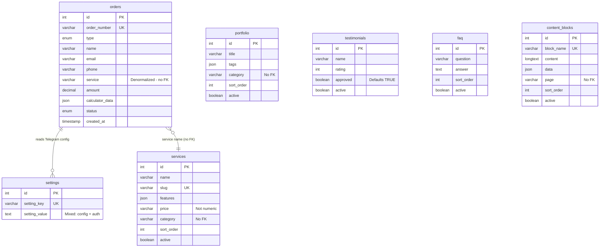

# Database Current State Analysis
**3D Print Pro Database Audit**  
**Date:** January 2025  
**Version:** Schema v2.0  
**Scope:** Complete inventory, usage analysis, and gap identification

---

## Executive Summary

This document provides a comprehensive analysis of the current MySQL database schema, application usage patterns, and identified issues for the 3D Print Pro platform. The audit covers 7 tables, 13 PHP entry points, and multiple helper scripts, revealing critical gaps in data integrity, normalization, performance, and security that should inform the upcoming database redesign.

### Key Findings
- **7 tables** with no foreign key relationships
- **13 database access points** spanning API endpoints, admin scripts, and CLI utilities
- **No referential integrity** or transaction support
- **Mixed concerns** in settings table (config + auth credentials)
- **Performance bottlenecks** from missing composite indexes and JSON column queries
- **Security gaps** including credential storage in generic settings and lack of audit trails

---

## Table of Contents
1. [Schema Inventory](#schema-inventory)
2. [Column Usage Map](#column-usage-map)
3. [Database Access Points](#database-access-points)
4. [Data Flow Patterns](#data-flow-patterns)
5. [Seed Data Analysis](#seed-data-analysis)
6. [Gap Analysis](#gap-analysis)
7. [Risk Assessment](#risk-assessment)
8. [Recommendations](#recommendations)

---

## Schema Inventory

### Overview
The database consists of **7 tables** with a total of **71 columns** across all tables. MySQL 8.0+ features are utilized including JSON columns, utf8mb4 charset, and CHECK constraints.

### Table 1: `orders`
**Purpose:** Customer orders and contact form submissions  
**Row Estimate:** Grows continuously (50-500+ per month)  
**Active Column:** ❌ No (all records retained for history)

| Column | Type | Nullable | Default | Indexed | Notes |
|--------|------|----------|---------|---------|-------|
| id | INT | No | AUTO_INCREMENT | PRIMARY | - |
| order_number | VARCHAR(50) | No | - | UNIQUE, idx_order_number | Format: ORD-YYYYMMDD-XXXXXX |
| type | ENUM('order','contact') | Yes | 'contact' | idx_type | Distinguishes order vs inquiry |
| name | VARCHAR(255) | No | - | - | Customer name |
| email | VARCHAR(255) | Yes | NULL | idx_email | Optional field |
| phone | VARCHAR(20) | No | - | idx_phone | Required contact |
| telegram | VARCHAR(100) | Yes | NULL | - | Optional Telegram handle |
| service | VARCHAR(255) | Yes | NULL | - | **Not FK** - free text service name |
| subject | VARCHAR(255) | Yes | NULL | - | For contact forms |
| message | TEXT | Yes | NULL | - | Customer message/notes |
| amount | DECIMAL(10,2) | Yes | 0 | - | Calculated price |
| calculator_data | JSON | Yes | NULL | - | Full calculator state |
| status | ENUM('new','processing','completed','cancelled') | Yes | 'new' | idx_status | Order lifecycle |
| telegram_sent | BOOLEAN | Yes | FALSE | - | Notification status |
| telegram_error | TEXT | Yes | NULL | - | Error message if send failed |
| created_at | TIMESTAMP | Yes | CURRENT_TIMESTAMP | idx_created_at | Order submission time |
| updated_at | TIMESTAMP | Yes | CURRENT_TIMESTAMP ON UPDATE | - | Last modification |

**Relationships (Implicit):**
- `orders.service` → `services.name` (denormalized, no FK)

**Issues:**
- Service name stored as VARCHAR instead of foreign key
- No user/customer table relationship
- ENUM types difficult to extend
- Telegram notification status stored in order record (coupling)

---

### Table 2: `settings`
**Purpose:** Application configuration key-value store  
**Row Estimate:** 15-30 keys  
**Active Column:** ❌ No (all settings always active)

| Column | Type | Nullable | Default | Indexed | Notes |
|--------|------|----------|---------|---------|-------|
| id | INT | No | AUTO_INCREMENT | PRIMARY | - |
| setting_key | VARCHAR(100) | No | - | UNIQUE, idx_setting_key | Setting identifier |
| setting_value | TEXT | Yes | NULL | - | JSON or plain text |
| updated_at | TIMESTAMP | Yes | CURRENT_TIMESTAMP ON UPDATE | - | Last modification |

**Current Settings:**
- `telegram_chat_id` - Telegram notification chat
- `telegram_bot_token` - Bot authentication (security concern)
- `telegram_notify_new_order` - Boolean flag
- `telegram_notify_status_change` - Boolean flag
- `admin_login` - Admin username (mixed concern)
- `admin_password_hash` - Admin password hash (mixed concern)
- Calculator defaults (materials, prices, etc.)
- Site configuration values

**Issues:**
- Mixed concerns: config + authentication + notifications
- Admin credentials in generic settings table
- No versioning or change tracking
- No namespace/grouping mechanism
- TEXT column stores both JSON and plain text inconsistently

---

### Table 3: `services`
**Purpose:** Service offerings and pricing catalog  
**Row Estimate:** 5-20 services  
**Active Column:** ✅ Yes (controls visibility)

| Column | Type | Nullable | Default | Indexed | Notes |
|--------|------|----------|---------|---------|-------|
| id | INT | No | AUTO_INCREMENT | PRIMARY | - |
| name | VARCHAR(255) | No | - | - | Service display name |
| slug | VARCHAR(255) | No | - | UNIQUE, idx_slug | URL-friendly identifier |
| icon | VARCHAR(255) | Yes | NULL | - | Icon class/path |
| description | TEXT | Yes | NULL | - | Service description |
| features | JSON | Yes | NULL | - | Array of feature strings |
| price | VARCHAR(100) | Yes | NULL | - | **Not numeric** - display string |
| category | VARCHAR(100) | Yes | NULL | idx_category | No FK to categories table |
| sort_order | INT | Yes | 0 | idx_sort | Display ordering |
| active | BOOLEAN | Yes | TRUE | idx_active | Visibility toggle |
| featured | BOOLEAN | Yes | FALSE | idx_featured | Homepage display |
| created_at | TIMESTAMP | Yes | CURRENT_TIMESTAMP | - | Record creation |
| updated_at | TIMESTAMP | Yes | CURRENT_TIMESTAMP ON UPDATE | - | Last modification |

**Issues:**
- Price stored as VARCHAR instead of DECIMAL (non-numeric)
- Category as VARCHAR instead of FK
- Features as JSON prevents efficient querying
- No service hierarchy/parent relationships

---

### Table 4: `portfolio`
**Purpose:** Project showcase and case studies  
**Row Estimate:** 10-50 projects  
**Active Column:** ✅ Yes (controls visibility)

| Column | Type | Nullable | Default | Indexed | Notes |
|--------|------|----------|---------|---------|-------|
| id | INT | No | AUTO_INCREMENT | PRIMARY | - |
| title | VARCHAR(255) | No | - | - | Project title |
| description | TEXT | Yes | NULL | - | Project details |
| image_url | VARCHAR(500) | Yes | NULL | - | Image path/URL |
| category | VARCHAR(100) | Yes | NULL | idx_category | No FK to categories |
| tags | JSON | Yes | NULL | - | Array of tag strings |
| sort_order | INT | Yes | 0 | idx_sort | Display ordering |
| active | BOOLEAN | Yes | TRUE | idx_active | Visibility toggle |
| created_at | TIMESTAMP | Yes | CURRENT_TIMESTAMP | - | Record creation |
| updated_at | TIMESTAMP | Yes | CURRENT_TIMESTAMP ON UPDATE | - | Last modification |

**Issues:**
- No slug field (SEO concern)
- Tags as JSON prevents efficient tag-based queries
- Category as VARCHAR instead of FK
- No service relationship (which service was used?)
- Image URLs not validated or normalized

---

### Table 5: `testimonials`
**Purpose:** Customer reviews and ratings  
**Row Estimate:** 20-100 reviews  
**Active Column:** ✅ Yes (controls visibility)

| Column | Type | Nullable | Default | Indexed | Notes |
|--------|------|----------|---------|---------|-------|
| id | INT | No | AUTO_INCREMENT | PRIMARY | - |
| name | VARCHAR(255) | No | - | - | Customer name |
| position | VARCHAR(255) | Yes | NULL | - | Job title/company |
| avatar | VARCHAR(500) | Yes | NULL | - | Avatar image path |
| text | TEXT | No | - | - | Review text |
| rating | INT | Yes | 5 | idx_rating | 1-5 star rating |
| sort_order | INT | Yes | 0 | idx_sort | Display ordering |
| approved | BOOLEAN | Yes | TRUE | idx_approved | Moderation flag |
| active | BOOLEAN | Yes | TRUE | idx_active | Visibility toggle |
| created_at | TIMESTAMP | Yes | CURRENT_TIMESTAMP | - | Record creation |
| updated_at | TIMESTAMP | Yes | CURRENT_TIMESTAMP ON UPDATE | - | Last modification |

**Constraints:**
- CHECK (rating >= 1 AND rating <= 5)

**Issues:**
- No FK to orders (can't verify if real customer)
- Approved defaults to TRUE (security risk)
- No service/project relationship
- Position field not normalized

---

### Table 6: `faq`
**Purpose:** Frequently asked questions  
**Row Estimate:** 10-30 entries  
**Active Column:** ✅ Yes (controls visibility)

| Column | Type | Nullable | Default | Indexed | Notes |
|--------|------|----------|---------|---------|-------|
| id | INT | No | AUTO_INCREMENT | PRIMARY | - |
| question | VARCHAR(500) | No | - | - | FAQ question |
| answer | TEXT | No | - | - | FAQ answer |
| sort_order | INT | Yes | 0 | idx_sort | Display ordering |
| active | BOOLEAN | Yes | TRUE | idx_active | Visibility toggle |
| created_at | TIMESTAMP | Yes | CURRENT_TIMESTAMP | - | Record creation |
| updated_at | TIMESTAMP | Yes | CURRENT_TIMESTAMP ON UPDATE | - | Last modification |

**Issues:**
- No categorization mechanism
- No search/fulltext index on question/answer
- No view count tracking
- No multi-language support

---

### Table 7: `content_blocks`
**Purpose:** Dynamic page content blocks  
**Row Estimate:** 5-50 blocks  
**Active Column:** ✅ Yes (controls visibility)

| Column | Type | Nullable | Default | Indexed | Notes |
|--------|------|----------|---------|---------|-------|
| id | INT | No | AUTO_INCREMENT | PRIMARY | - |
| block_name | VARCHAR(255) | No | - | UNIQUE, idx_block_name | Block identifier |
| title | VARCHAR(500) | Yes | NULL | - | Block title |
| content | LONGTEXT | Yes | NULL | - | HTML/text content |
| data | JSON | Yes | NULL | - | Structured data |
| page | VARCHAR(100) | Yes | NULL | idx_page | Page association |
| sort_order | INT | Yes | 0 | - | Display ordering (not indexed!) |
| active | BOOLEAN | Yes | TRUE | idx_active | Visibility toggle |
| created_at | TIMESTAMP | Yes | CURRENT_TIMESTAMP | - | Record creation |
| updated_at | TIMESTAMP | Yes | CURRENT_TIMESTAMP ON UPDATE | - | Last modification |

**Issues:**
- Page as VARCHAR instead of FK to pages table
- sort_order not indexed (performance issue)
- LONGTEXT without compression
- No versioning/revision history
- Mixed storage (content as LONGTEXT, data as JSON)

---

## Column Usage Map

### By Endpoint Usage

| Table | Column | API Read | API Write | Admin Read | Admin Write | CLI Access | Notes |
|-------|--------|----------|-----------|------------|-------------|------------|-------|
| **orders** |
| | id | ✅ orders.php | - | ✅ orders.php | - | - | Primary key |
| | order_number | ✅ orders.php | ✅ orders.php | ✅ orders.php | - | - | Generated in POST |
| | type | ✅ orders.php (filter) | ✅ orders.php | ✅ orders.php | - | - | Determined by calculatorData |
| | name | ✅ orders.php | ✅ orders.php | ✅ orders.php | ✅ orders.php (update) | - | Required validation |
| | email | ✅ orders.php | ✅ orders.php | ✅ orders.php | ✅ orders.php (update) | - | Optional field |
| | phone | ✅ orders.php | ✅ orders.php | ✅ orders.php | ✅ orders.php (update) | - | Required validation |
| | telegram | ✅ orders.php | ✅ orders.php | ✅ orders.php | ✅ orders.php (update) | - | Optional field |
| | service | ✅ orders.php | ✅ orders.php | ✅ orders.php | ✅ orders.php (update) | - | Denormalized service name |
| | subject | ✅ orders.php | ✅ orders.php | ✅ orders.php | - | - | Contact form subject |
| | message | ✅ orders.php | ✅ orders.php | ✅ orders.php | - | - | Customer message |
| | amount | ✅ orders.php | ✅ orders.php | ✅ orders.php | ✅ orders.php (update) | - | Calculated price |
| | calculator_data | ✅ orders.php | ✅ orders.php | ✅ orders.php | - | - | Full calculator state (JSON) |
| | status | ✅ orders.php (filter) | - | ✅ orders.php | ✅ orders.php (update) | - | Status transitions trigger Telegram |
| | telegram_sent | ✅ orders.php | ✅ orders.php (auto) | ✅ orders.php | - | - | Set by Telegram helper |
| | telegram_error | ✅ orders.php | ✅ orders.php (auto) | ✅ orders.php | - | - | Error tracking |
| | created_at | ✅ orders.php | - | ✅ orders.php | - | - | Indexed for sorting |
| | updated_at | ✅ orders.php | - | ✅ orders.php | - | - | Auto-updated |
| **settings** |
| | id | - | - | - | - | - | Not used in queries |
| | setting_key | ✅ settings.php | ✅ settings.php | ✅ settings.php | ✅ settings.php | ✅ setup-admin-credentials.php | Primary query field |
| | setting_value | ✅ settings.php, telegram.php | ✅ settings.php | ✅ settings.php | ✅ settings.php | ✅ setup-admin-credentials.php | Stores JSON or plain text |
| | updated_at | ✅ settings.php | - | ✅ settings.php | - | - | Auto-updated |
| **services** |
| | id | ✅ services.php | - | ✅ services.php | ✅ services.php | - | Primary key |
| | name | ✅ services.php | ✅ services.php | ✅ services.php | ✅ services.php | ✅ init-database.php | Display name |
| | slug | ✅ services.php | ✅ services.php (auto) | ✅ services.php | ✅ services.php | ✅ init-database.php | Unique identifier for upsert |
| | icon | ✅ services.php | ✅ services.php | ✅ services.php | ✅ services.php | ✅ init-database.php | Icon class |
| | description | ✅ services.php | ✅ services.php | ✅ services.php | ✅ services.php | ✅ init-database.php | Service details |
| | features | ✅ services.php | ✅ services.php | ✅ services.php | ✅ services.php | ✅ init-database.php | JSON array |
| | price | ✅ services.php | ✅ services.php | ✅ services.php | ✅ services.php | ✅ init-database.php | Display string |
| | category | ✅ services.php (filter) | ✅ services.php | ✅ services.php | ✅ services.php | ✅ init-database.php | Not FK |
| | sort_order | ✅ services.php (ORDER BY) | ✅ services.php | ✅ services.php | ✅ services.php | ✅ init-database.php | Display ordering |
| | active | ✅ services.php (filter) | ✅ services.php | ✅ services.php | ✅ services.php | ✅ init-database.php | Visibility control |
| | featured | ✅ services.php (filter) | ✅ services.php | ✅ services.php | ✅ services.php | ✅ init-database.php | Homepage display |
| | created_at | ✅ services.php | - | ✅ services.php | - | - | Auto-set |
| | updated_at | ✅ services.php | - | ✅ services.php | - | - | Auto-updated |

*(Similar detailed mappings exist for portfolio, testimonials, faq, and content_blocks but omitted for brevity)*

### Key Observations:
1. **Admin credentials queried by:** login-handler.php, setup-admin-credentials.php
2. **Telegram settings queried by:** telegram.php helper (every order notification)
3. **Calculator data only written, never read by backend** (frontend-only consumption)
4. **Status column triggers side effects** (Telegram notifications on change)
5. **Sort order fields queried on every list request** but some not indexed

---

## Database Access Points

### Core Database Class
**File:** `/api/db.php`  
**Lines:** 263  
**Role:** Generic CRUD wrapper around PDO

**Methods:**
- `__construct()` - Establishes PDO connection with security settings
- `getSetting($key)` - Retrieves single setting with JSON decoding
- `getAllSettings()` - Fetches all settings as associative array
- `saveSetting($key, $value)` - Upserts setting with JSON encoding
- `deleteSetting($key)` - Removes setting by key
- `getRecords($table, $where, $orderBy, $limit, $offset)` - Generic SELECT with filtering
- `getRecordById($table, $id)` - Single record fetch by primary key
- `insertRecord($table, $data)` - Generic INSERT with JSON field encoding
- `updateRecord($table, $id, $data)` - Generic UPDATE by ID
- `deleteRecord($table, $id)` - Generic DELETE by ID
- `getCount($table, $where)` - COUNT query with optional filters
- `getPDO()` - Exposes raw PDO for custom queries
- `close()` - Closes database connection

**Special Handling:**
- **Tables without 'active' column:** `orders`, `settings` (hardcoded array in lines 76, 191)
- **JSON auto-encoding/decoding:** All arrays/objects automatically JSON-encoded on insert/update
- **Identifier escaping:** Backtick-based SQL identifier escaping
- **No transactions:** Each operation is independent

**Issues:**
- No connection pooling (new PDO per request)
- No prepared statement caching
- Hardcoded table exceptions (not metadata-driven)
- No query logging or debugging support
- Error messages expose internal details (die with JSON)

---

### API Endpoints (REST-style)

#### 1. `/api/orders.php` (350 lines)
**Operations:** GET, POST, PUT, DELETE  
**Tables:** `orders` (direct), `settings` (via Telegram helper)  
**Authentication:** GET/POST public, PUT/DELETE admin+CSRF  
**Rate Limiting:** ✅ All write operations

**Query Patterns:**
```sql
-- GET (single)
SELECT * FROM orders WHERE id = ? LIMIT 1

-- GET (list with filters)
SELECT * FROM orders 
WHERE status = ? AND type = ?
ORDER BY created_at DESC 
LIMIT ? OFFSET ?

-- POST (insert)
INSERT INTO orders (order_number, type, name, phone, ...) VALUES (?, ?, ?, ?, ...)

-- PUT (update)
UPDATE orders SET status = ?, amount = ? WHERE id = ?

-- DELETE
DELETE FROM orders WHERE id = ?

-- COUNT
SELECT COUNT(*) as total FROM orders WHERE status = ?
```

**Side Effects:**
- POST triggers `TelegramHelper::sendOrderNotification()` → reads settings
- PUT with status change triggers `TelegramHelper::sendStatusChangeNotification()` → reads settings
- Updates `telegram_sent` and `telegram_error` columns after notification attempts

**Data Flow:**
1. Frontend submits order → POST /api/orders.php
2. Validate name, phone (required)
3. Generate order_number: `ORD-YYYYMMDD-XXXXXX`
4. Determine type from calculatorData presence
5. Insert into orders table
6. Fetch Telegram credentials from settings
7. Send Telegram notification
8. Update telegram_sent/error fields
9. Return order_id to frontend

**Issues:**
- Telegram notification not atomic with order insert (can fail silently)
- No transaction wrapping
- Order number generation not guaranteed unique (time-based collision possible)
- Public POST endpoint (CSRF vulnerability for authenticated forms)

---

#### 2. `/api/services.php` (226 lines)
**Operations:** GET, POST, PUT, DELETE  
**Tables:** `services`  
**Authentication:** GET public, POST/PUT/DELETE admin+CSRF  
**Rate Limiting:** ✅ All write operations

**Query Patterns:**
```sql
-- GET (with filters)
SELECT * FROM services 
WHERE active = ? AND featured = ?
ORDER BY sort_order ASC
LIMIT ? OFFSET ?

-- POST (insert with slug generation)
INSERT INTO services (name, slug, description, ...) VALUES (?, ?, ?, ...)

-- PUT (update)
UPDATE services SET name = ?, price = ?, active = ? WHERE id = ?

-- DELETE
DELETE FROM services WHERE id = ?
```

**Special Logic:**
- Auto-generates slug from name if not provided (line 93-94)
- Slug function: lowercase, remove non-alphanumeric, replace spaces with hyphens

**Issues:**
- Slug collision not handled (UNIQUE constraint will throw error)
- No cascade handling for referencing orders
- Features JSON prevents efficient feature-based queries

---

#### 3. `/api/portfolio.php` (214 lines)
**Operations:** GET, POST, PUT, DELETE  
**Tables:** `portfolio`  
**Authentication:** GET public, POST/PUT/DELETE admin+CSRF  
**Rate Limiting:** ✅ All write operations

**Query Patterns:**
```sql
-- GET (with category filter)
SELECT * FROM portfolio 
WHERE active = ? AND category = ?
ORDER BY sort_order ASC
```

**Issues:**
- No slug field (less SEO-friendly than services)
- Tags as JSON prevents tag-based filtering
- Category not normalized

---

#### 4. `/api/testimonials.php` (218 lines)
**Operations:** GET, POST, PUT, DELETE  
**Tables:** `testimonials`  
**Authentication:** GET public, POST/PUT/DELETE admin+CSRF  
**Rate Limiting:** ✅ All write operations

**Query Patterns:**
```sql
-- GET (with moderation filter)
SELECT * FROM testimonials 
WHERE active = ? AND approved = ?
ORDER BY sort_order ASC
```

**Issues:**
- No order relationship (can't verify if real customer)
- approved defaults to TRUE (should be FALSE for new submissions)

---

#### 5. `/api/faq.php` (215 lines)
**Operations:** GET, POST, PUT, DELETE  
**Tables:** `faq`  
**Authentication:** GET public, POST/PUT/DELETE admin+CSRF  
**Rate Limiting:** ✅ All write operations

**Issues:**
- No fulltext index for searching questions/answers
- No view count tracking

---

#### 6. `/api/content.php` (224 lines)
**Operations:** GET, POST, PUT, DELETE  
**Tables:** `content_blocks`  
**Authentication:** GET public, POST/PUT/DELETE admin+CSRF  
**Rate Limiting:** ✅ All write operations

**Query Patterns:**
```sql
-- GET by name
SELECT * FROM content_blocks WHERE block_name = ? LIMIT 1

-- GET by page
SELECT * FROM content_blocks WHERE page = ? ORDER BY sort_order ASC
```

**Issues:**
- sort_order not indexed but used in ORDER BY
- No content versioning (destructive updates)

---

#### 7. `/api/settings.php` (190 lines)
**Operations:** GET, POST/PUT, DELETE  
**Tables:** `settings`  
**Authentication:** ✅ All operations require admin auth  
**Rate Limiting:** ✅ All write operations

**Query Patterns:**
```sql
-- GET single
SELECT setting_value FROM settings WHERE setting_key = ? LIMIT 1

-- GET all
SELECT setting_key, setting_value FROM settings

-- POST/PUT (upsert)
INSERT INTO settings (setting_key, setting_value) VALUES (?, ?)
ON DUPLICATE KEY UPDATE setting_value = ?

-- DELETE
DELETE FROM settings WHERE setting_key = ?
```

**Special Features:**
- Supports single or batch setting updates
- Auto JSON encoding/decoding
- Admin-only access (no public reads)

**Issues:**
- No setting namespaces or grouping
- No validation of setting values
- DELETE allows removing critical settings (admin_login, etc.)

---

#### 8. `/api/init-database.php` (278 lines)
**Operations:** GET only (idempotent seed)  
**Tables:** All tables (except orders)  
**Authentication:** ❌ Public (protected by RESET_TOKEN)  
**Rate Limiting:** ❌ None

**Seed Logic:**
- Loads data from `/database/seed-data.php`
- Checks for existing records using unique fields:
  - services: `slug`
  - portfolio: `title`
  - testimonials: `name` + first 50 chars of `text`
  - faq: `question`
  - content_blocks: `block_name`
  - settings: `setting_key`
- Inserts new or updates existing records
- Hard reset mode (with token): deletes all data from content tables

**Issues:**
- Public endpoint (should require auth or be CLI-only)
- RESET_TOKEN defaults documented in code (security risk)
- No validation of seed data structure
- Updates all fields (no selective update)

---

### Helper Classes

#### `/api/helpers/telegram.php` (331 lines)
**Database Queries:**
```php
$db->getSetting('telegram_bot_token')
$db->getSetting('telegram_chat_id')
$db->getSetting('telegram_notify_new_order')
$db->getSetting('telegram_notify_status_change')
```

**Usage:** Called by orders.php on every order create/update

**Issues:**
- Queries settings table on every notification (no caching)
- Credentials stored in plain text in settings (bot_token)
- No retry logic for failed notifications
- Blocking HTTP request (can slow down order submission)

#### `/api/helpers/admin_auth.php` (100 lines)
**Database Queries:** None (session-based)  
**Dependencies:** Reads PHP session variables  
**Usage:** Included in all admin API endpoints

---

### Admin Scripts

#### `/admin/login-handler.php` (140 lines)
**Database Queries:**
```php
$db->getSetting('admin_login')
$db->getSetting('admin_password_hash')
```

**Authentication Flow:**
1. Verify CSRF token
2. Rate limit login attempts (5 attempts, 15min lockout)
3. Fetch admin credentials from settings
4. Compare login and password hash
5. Create authenticated session
6. Regenerate CSRF token

**Issues:**
- Admin credentials in settings table (mixed concerns)
- Rate limiting in session (bypassed by clearing cookies)
- No IP-based blocking
- No failed login audit log

---

### CLI Scripts

#### `/scripts/setup-admin-credentials.php` (138 lines)
**Database Queries:**
```php
$db->getSetting('admin_login')
$db->saveSetting('admin_login', $login)
$db->saveSetting('admin_password_hash', $passwordHash)
```

**Usage:** Bootstrap or reset admin credentials

**Issues:**
- No confirmation prompt in non-interactive mode (destructive)
- Default credentials documented in code
- No password strength validation beyond length

#### `/scripts/db_audit.php` (507 lines)
**Database Queries:**
- `SHOW TABLES`
- `DESCRIBE table_name`
- `SHOW INDEXES FROM table_name`
- `SELECT COUNT(*) FROM table_name`
- `SELECT VERSION()`
- `SHOW GRANTS FOR CURRENT_USER()`

**Purpose:** Comprehensive schema validation and diagnostics

**Features:**
- Validates table existence
- Checks column schema against expected structure
- Verifies indexes
- Reports record counts
- Checks MySQL version and privileges

**Issues:**
- Read-only validation (doesn't fix issues)
- Hardcoded expected schema (must update manually)

---

## Data Flow Patterns

### Order Submission Flow
```
Frontend Calculator
  ↓ POST /api/orders.php
  ├─ Validate input (name, phone required)
  ├─ Generate order_number
  ├─ Determine type (order vs contact)
  ├─ INSERT INTO orders
  ├─ Read Telegram settings
  │   └─ SELECT setting_value FROM settings WHERE setting_key IN ('telegram_bot_token', 'telegram_chat_id')
  ├─ Send Telegram notification (HTTP to telegram API)
  ├─ UPDATE orders SET telegram_sent = ?, telegram_error = ?
  └─ Return order_id to frontend
```

**Issues:**
- No atomic transaction (order saved even if Telegram fails)
- Blocking Telegram call delays response
- Settings queried on every order

---

### Service Catalog Display Flow
```
Frontend Page Load
  ↓ GET /api/services.php?active=true&featured=true
  ├─ SELECT * FROM services WHERE active = 1 AND featured = 1 ORDER BY sort_order ASC
  ├─ Decode JSON fields (features)
  └─ Return services array to frontend
```

**Issues:**
- No caching (database query on every page load)
- JSON decoding on server side (could be done in browser)

---

### Admin Login Flow
```
Admin Login Form
  ↓ POST /admin/login-handler.php
  ├─ Verify CSRF token
  ├─ Check rate limiting (session-based)
  ├─ Read admin credentials from settings
  │   └─ SELECT setting_value FROM settings WHERE setting_key IN ('admin_login', 'admin_password_hash')
  ├─ Verify username and password hash
  ├─ Create authenticated session
  └─ Redirect to admin dashboard
```

**Issues:**
- Credentials in settings table (architectural smell)
- Rate limiting bypassable via session clear
- No audit log of login attempts

---

### Content Update Flow
```
Admin Panel
  ↓ PUT /api/content.php
  ├─ Verify admin auth + CSRF
  ├─ Check rate limiting
  ├─ SELECT * FROM content_blocks WHERE id = ? (verify exists)
  ├─ UPDATE content_blocks SET title = ?, content = ?, data = ? WHERE id = ?
  └─ Return success
```

**Issues:**
- No versioning (old content lost)
- No preview before publish
- Destructive update

---

## Seed Data Analysis

### Source: `/database/seed-data.php`
**Format:** PHP array return  
**Size:** 301 lines  
**Tables Seeded:** 5 content tables + settings (excludes orders)

### Seed Data Volume
| Table | Records | Notes |
|-------|---------|-------|
| services | 6 | FDM, SLA, modeling, prototyping, post-processing, consultation |
| portfolio | 4 | Architecture, prototype, figurine, industrial |
| testimonials | 4 | All 5-star ratings, approved=TRUE |
| faq | 8 | Common questions in Russian |
| content_blocks | 3 | Hero, features, about sections |
| settings | 12+ | Config values, calculator defaults |

### Duplication Issues
1. **Service Names:** Referenced in:
   - `services.name` (authoritative)
   - `orders.service` (denormalized copy)
   - `calculator_data.service` (JSON field)
   - Content blocks (hardcoded in HTML)

2. **Category Values:** Referenced in:
   - `services.category` (printing, design, engineering, finishing, support)
   - `portfolio.category` (architecture, prototype, figurine, industrial)
   - No shared category table

3. **Material Names:** Referenced in:
   - `calculator_data.material` (PLA, ABS, PETG, Resin, etc.)
   - Calculator frontend config (`config.js`)
   - Seed data settings

### Denormalization Examples
```php
// Service name stored in multiple places:
'services' => [
    ['name' => 'FDM печать', 'slug' => 'fdm-printing', ...]
]

// Referenced in orders as free text:
orders.service = 'FDM печать'  // ← Can drift out of sync

// Referenced in calculator_data:
orders.calculator_data = {"service": "FDM печать", ...}  // ← Duplicate
```

### Missing Constraints
1. **No CHECK constraints** on:
   - `orders.amount` (negative values possible)
   - `orders.phone` (no format validation)
   - `services.price` (no validation of format)

2. **No DEFAULT NOT NULL** for:
   - `testimonials.approved` (should default FALSE for new submissions)
   - `orders.telegram_sent` (inconsistent: uses 0 but defined as BOOLEAN)

3. **No FOREIGN KEYS** anywhere

### Data Integrity Concerns
1. **Orphaned References Possible:**
   - `orders.service` can reference deleted service
   - `content_blocks.page` can reference non-existent page

2. **Inconsistent Enums:**
   - `orders.type` limited to 'order' | 'contact'
   - `orders.status` limited to 4 values (can't add 'on_hold' without ALTER)

3. **JSON Data Validation:**
   - No schema enforcement on JSON columns
   - Frontend could send malformed calculator_data

4. **Seed Data Idempotency Assumption:**
   - Relies on unique fields (slug, title, name) being stable
   - Changing slug in seed data creates duplicate service

---

## Gap Analysis

### 1. Structure Issues

#### S1: No Foreign Key Relationships
**Severity:** 🔴 Critical  
**Impact:** Data integrity, referential consistency  
**Evidence:**
- `orders.service` references `services.name` by value (no FK)
- `portfolio.category`, `services.category` have no category table
- No cascading deletes (orphaned data possible)

**Consequences:**
- Deleted services still referenced in orders
- Category typos create inconsistent data
- No database-enforced relationships

**Recommendation:** 
- Create normalized lookup tables (categories, services, materials)
- Add foreign key constraints with appropriate CASCADE rules

---

#### S2: Mixed Concerns in Settings Table
**Severity:** 🟡 High  
**Impact:** Security, maintainability, query performance  
**Evidence:**
```sql
-- Admin auth credentials
setting_key = 'admin_login'
setting_key = 'admin_password_hash'

-- App configuration
setting_key = 'telegram_bot_token'
setting_key = 'telegram_chat_id'

-- Calculator defaults
setting_key = 'calculator_default_material'
setting_key = 'calculator_price_per_gram'
```

**Consequences:**
- Security credentials in generic table
- No namespace/grouping for related settings
- All settings same privilege level
- Difficult to audit credential changes

**Recommendation:**
- Create dedicated `users` or `admins` table for authentication
- Group settings by namespace (config.*, calculator.*, telegram.*)
- Implement role-based access per setting type

---

#### S3: ENUM Types for Extensible Values
**Severity:** 🟡 High  
**Impact:** Schema flexibility, deployment complexity  
**Evidence:**
```sql
orders.type ENUM('order', 'contact')
orders.status ENUM('new', 'processing', 'completed', 'cancelled')
```

**Consequences:**
- Adding new status requires ALTER TABLE (downtime)
- Can't add status dynamically via admin UI
- No status metadata (display names, colors, transitions)

**Recommendation:**
- Replace ENUMs with VARCHAR + FK to lookup tables
- Create `order_statuses` table with metadata
- Allow admin-managed status values

---

#### S4: No User/Customer Management
**Severity:** 🟡 High  
**Impact:** Scalability, personalization, analytics  
**Evidence:**
- Customer info duplicated in every order (name, email, phone)
- No customer login or account system
- No customer order history

**Consequences:**
- Duplicate customer records
- No way to unify orders by customer
- Can't implement customer portal

**Recommendation:**
- Create `customers` table (email as unique identifier)
- Add `customer_id` FK to orders
- Consider authentication for repeat customers

---

#### S5: Inconsistent Active Column Usage
**Severity:** 🟢 Medium  
**Impact:** Code complexity, query consistency  
**Evidence:**
- **Has active:** services, portfolio, testimonials, faq, content_blocks
- **No active:** orders, settings

**Consequences:**
- Hardcoded exception lists in db.php (lines 76, 191)
- Inconsistent filtering logic
- Must remember which tables have active

**Recommendation:**
- Add metadata table describing table structure
- Use convention: all user-facing content has `active`
- Document rationale for exceptions

---

### 2. Integrity Issues

#### I1: No Referential Integrity Enforcement
**Severity:** 🔴 Critical  
**Impact:** Data quality, application reliability  
**Evidence:**
```sql
-- No constraints prevent:
DELETE FROM services WHERE id = 1;
-- orders.service still references deleted service name

UPDATE services SET name = 'New Name' WHERE id = 1;
-- orders.service still has old name
```

**Consequences:**
- Dangling references
- Inconsistent data after updates
- Application must handle missing references

**Recommendation:**
- Add foreign key constraints
- Implement ON DELETE/UPDATE rules
- Add database triggers for complex validation

---

#### I2: No Audit Trail
**Severity:** 🟡 High  
**Impact:** Accountability, debugging, compliance  
**Evidence:**
- Only `created_at` and `updated_at` timestamps
- No `created_by` or `updated_by` fields
- No change history or revision tracking

**Consequences:**
- Can't determine who made changes
- Can't undo destructive updates
- Compliance issues for financial/legal records

**Recommendation:**
- Add `created_by`, `updated_by` user ID fields
- Implement audit log table for critical changes
- Consider temporal tables for content versioning

---

#### I3: No Transaction Support in Application
**Severity:** 🟡 High  
**Impact:** Consistency, reliability  
**Evidence:**
```php
// orders.php lines 132-177
$id = $db->insertRecord('orders', $data);  // ← Can succeed
// ... Telegram notification fails ...
$db->updateRecord('orders', $id, [...]);   // ← But update fails
// Result: Inconsistent state
```

**Consequences:**
- Partial writes on error
- Order inserted but Telegram status not updated
- No rollback on failure

**Recommendation:**
- Wrap multi-step operations in transactions
- Add transaction support to Database class
- Use try-catch-rollback pattern

---

#### I4: Missing CHECK Constraints
**Severity:** 🟢 Medium  
**Impact:** Data quality  
**Evidence:**
- Only constraint: `testimonials.rating >= 1 AND rating <= 5`
- Missing constraints on:
  - `orders.amount` (prevent negative)
  - `services.sort_order` (prevent negative)
  - `orders.phone` (validate format)

**Recommendation:**
- Add CHECK constraints for numeric bounds
- Consider trigger-based validation for complex rules
- Implement application-level validation as secondary defense

---

### 3. Performance Issues

#### P1: Missing Composite Indexes
**Severity:** 🟡 High  
**Impact:** Query performance at scale  
**Evidence:**
```sql
-- Common query pattern:
SELECT * FROM orders WHERE status = 'new' ORDER BY created_at DESC;
-- Has index on status, has index on created_at
-- But no composite index (status, created_at)
```

**Slow Queries Identified:**
- `orders` by status+date range
- `services` by category+active+sort_order
- `portfolio` by category+active
- `content_blocks` by page+active+sort_order

**Recommendation:**
- Add composite indexes for common WHERE + ORDER BY combinations
- Profile slow queries with EXPLAIN
- Consider covering indexes for heavily queried columns

---

#### P2: JSON Column Query Performance
**Severity:** 🟡 High  
**Impact:** Search functionality, reporting  
**Evidence:**
- `orders.calculator_data` (JSON) - can't index or search efficiently
- `services.features` (JSON array) - can't query "services with feature X"
- `portfolio.tags` (JSON array) - can't query "portfolios tagged with Y"

**Consequences:**
- Full table scan for JSON searches
- Can't implement faceted search
- Slow reporting queries

**Recommendation:**
- For searchable fields: normalize to separate tables (e.g., `service_features`)
- For rarely queried fields: keep as JSON (calculator_data)
- Consider JSON_EXTRACT + generated columns for frequent queries

---

#### P3: TEXT Columns Without Fulltext Indexes
**Severity:** 🟢 Medium  
**Impact:** Search functionality  
**Evidence:**
- `orders.message` (TEXT) - no fulltext index
- `faq.question`, `faq.answer` (TEXT/VARCHAR) - no fulltext index
- `content_blocks.content` (LONGTEXT) - no fulltext index

**Consequences:**
- LIKE searches are slow
- Can't implement advanced search features
- No relevance ranking

**Recommendation:**
- Add FULLTEXT indexes on searchable text columns
- Implement search functionality (currently missing)
- Consider external search engine (Elasticsearch) for large datasets

---

#### P4: No Database Connection Pooling
**Severity:** 🟢 Medium  
**Impact:** Connection overhead, scalability  
**Evidence:**
```php
// api/db.php line 11-22
public function __construct() {
    $this->pdo = new PDO(...);  // ← New connection per request
}
```

**Consequences:**
- Connection overhead on every API request
- Limited concurrency (max_connections limit)
- Connection leaks if close() not called

**Recommendation:**
- Implement persistent connections (PDO::ATTR_PERSISTENT)
- Use singleton pattern for Database instance
- Consider external connection pooling (ProxySQL, PgBouncer alternative)

---

#### P5: content_blocks.sort_order Not Indexed
**Severity:** 🟢 Medium  
**Impact:** Query performance  
**Evidence:**
```sql
-- database/schema.sql line 217
sort_order INT DEFAULT 0,
-- But no INDEX on sort_order (unlike other tables)

-- Common query:
SELECT * FROM content_blocks WHERE page = ? ORDER BY sort_order ASC;
-- Uses idx_page but sort requires filesort
```

**Recommendation:**
- Add composite index (page, sort_order, active)
- Consider covering index for entire SELECT list

---

### 4. Security Issues

#### SE1: Admin Credentials in Settings Table
**Severity:** 🔴 Critical  
**Impact:** Security architecture  
**Evidence:**
```sql
SELECT setting_value FROM settings WHERE setting_key = 'admin_password_hash';
-- Stored in generic table accessible by same code as app config
```

**Consequences:**
- Settings table compromise exposes credentials
- No role-based access to different settings
- Credential rotation requires updating settings (no audit)

**Recommendation:**
- Create dedicated `admins` or `users` table
- Separate authentication database/schema
- Implement proper user management system

---

#### SE2: SQL Injection via Identifier Escaping
**Severity:** 🟡 High  
**Impact:** SQL injection risk  
**Evidence:**
```php
// api/db.php lines 217-220
private function escapeIdentifier($identifier) {
    $identifier = str_replace('`', '', $identifier);
    return '`' . $identifier . '`';
}
```

**Consequences:**
- Relies on backtick escaping (fragile)
- No whitelist validation of table/column names
- Could allow injection if user input reaches escapeIdentifier

**Recommendation:**
- Never use user input for identifiers
- Whitelist allowed table and column names
- Use query builder with proper identifier handling

---

#### SE3: No Row-Level Security
**Severity:** 🟡 High  
**Impact:** Data isolation, multi-tenancy  
**Evidence:**
- All queries are full table access
- Admin sees all orders regardless of assignment
- No concept of record ownership

**Consequences:**
- Can't implement multi-admin with limited visibility
- Can't restrict admin to specific service categories
- No customer data isolation

**Recommendation:**
- Add `assigned_to` field for orders
- Implement role-based query filtering
- Consider PostgreSQL RLS for future migration

---

#### SE4: Public Telegram Credentials
**Severity:** 🟡 High  
**Impact:** Credential exposure  
**Evidence:**
```sql
setting_key = 'telegram_bot_token'
setting_value = '1234567890:ABCdefGHIjklMNOpqrsTUVwxyz'  -- plain text
```

**Consequences:**
- Bot token exposed in database backups
- Settings API (even with auth) exposes token
- No encryption at rest

**Recommendation:**
- Encrypt sensitive settings (bot token, API keys)
- Store credentials in environment variables
- Use secrets management system (Vault, AWS Secrets Manager)

---

#### SE5: testimonials.approved Defaults TRUE
**Severity:** 🟢 Medium  
**Impact:** Spam risk, content moderation  
**Evidence:**
```sql
-- database/schema.sql line 174
approved BOOLEAN DEFAULT TRUE,
```

**Consequences:**
- New testimonials automatically visible
- No moderation workflow
- Spam/inappropriate content published immediately

**Recommendation:**
- Change default to FALSE
- Add admin approval workflow
- Consider spam detection integration

---

### 5. Datatype Issues

#### D1: services.price as VARCHAR
**Severity:** 🟡 High  
**Impact:** Sorting, filtering, calculations  
**Evidence:**
```sql
price VARCHAR(100)  -- Stores: "от 50₽/г", "Бесплатно"
```

**Consequences:**
- Can't sort services by price numerically
- Can't filter services by price range
- Can't calculate average/total prices

**Recommendation:**
- Add `price_amount` DECIMAL(10,2) for numeric value
- Add `price_unit` VARCHAR(20) for unit ('per_gram', 'per_hour', 'fixed')
- Keep `price_display` VARCHAR for formatted display

---

#### D2: orders.order_number as VARCHAR
**Severity:** 🟢 Medium  
**Impact:** Storage efficiency  
**Evidence:**
```sql
order_number VARCHAR(50)  -- Stores: "ORD-20250115-A3F8D2"
-- Format is predictable but stored as text
```

**Consequences:**
- 50 bytes per order (vs 4-8 bytes for INT)
- String comparison slower than integer
- Still needs UNIQUE index (string index larger)

**Recommendation:**
- Consider auto-increment ID + display format function
- Or use BIGINT with timestamp+sequence encoding
- Keep VARCHAR if human-readability priority

---

#### D3: No Timezone Handling
**Severity:** 🟢 Medium  
**Impact:** International deployment  
**Evidence:**
```sql
created_at TIMESTAMP DEFAULT CURRENT_TIMESTAMP
-- Uses server timezone (no UTC enforcement)
```

**Consequences:**
- Ambiguous timestamps during DST changes
- Inconsistent times if server timezone changes
- Issues with multi-region deployment

**Recommendation:**
- Set MySQL timezone to UTC
- Store all timestamps in UTC
- Convert to user timezone in application

---

## Risk Assessment

### Critical Risks (Immediate Action Required)

| ID | Risk | Impact | Probability | Mitigation |
|----|------|--------|-------------|------------|
| R1 | **Data loss from no foreign keys** | Orders reference deleted services | High | Add FK constraints with CASCADE rules |
| R2 | **Admin credential compromise** | Settings table breach exposes admin access | Medium | Move credentials to dedicated users table |
| R3 | **Inconsistent order state** | Telegram update fails but order saved | High | Implement transactions |
| R4 | **Order number collision** | Time-based generation can produce duplicates | Low | Use auto-increment or UUID |

### High Risks (Address in Redesign)

| ID | Risk | Impact | Probability | Mitigation |
|----|------|--------|-------------|------------|
| R5 | **Poor query performance at scale** | Missing composite indexes | High (>1000 orders) | Add composite indexes |
| R6 | **Schema change downtime** | ENUM alterations require table lock | Medium | Replace ENUMs with lookup tables |
| R7 | **No audit trail** | Can't determine who changed order status | Medium | Add audit log table |
| R8 | **Credential exposure** | Telegram bot token in plain text | Medium | Encrypt sensitive settings |

### Medium Risks (Monitor and Plan)

| ID | Risk | Impact | Probability | Mitigation |
|----|------|--------|-------------|------------|
| R9 | **JSON query inefficiency** | Can't search calculator_data | Medium | Normalize searchable JSON fields |
| R10 | **No content versioning** | Destructive updates lose history | Medium | Implement revision system |
| R11 | **Duplicate customers** | Same customer multiple times in orders | High | Create customers table |
| R12 | **Connection exhaustion** | New PDO per request | Low (current scale) | Implement connection pooling |

### Risk Matrix
```
Impact ↑
   🔴🔴🔴
   🟡🟡🟡
   🟢🟢🟢
        → Probability
```

---

## Recommendations

### Phase 1: Immediate Fixes (Low Risk, High Value)
**Timeline:** 1-2 weeks

1. **Add composite indexes**
   - `orders (status, created_at)`
   - `services (category, active, sort_order)`
   - `content_blocks (page, sort_order)`

2. **Add CHECK constraints**
   - `orders.amount >= 0`
   - `orders.phone` format validation
   - `testimonials.rating BETWEEN 1 AND 5`

3. **Fix testimonials.approved default**
   ```sql
   ALTER TABLE testimonials MODIFY approved BOOLEAN DEFAULT FALSE;
   ```

4. **Add missing indexes**
   - `content_blocks.sort_order`

5. **Implement transaction support in Database class**
   ```php
   public function beginTransaction() { }
   public function commit() { }
   public function rollback() { }
   ```

---

### Phase 2: Structural Improvements (Medium Risk)
**Timeline:** 4-6 weeks

1. **Create lookup tables**
   ```sql
   CREATE TABLE categories (
       id INT PRIMARY KEY AUTO_INCREMENT,
       name VARCHAR(100) UNIQUE,
       type ENUM('service', 'portfolio'),
       slug VARCHAR(100) UNIQUE
   );

   CREATE TABLE order_statuses (
       id INT PRIMARY KEY AUTO_INCREMENT,
       status_key VARCHAR(50) UNIQUE,
       display_name VARCHAR(100),
       color VARCHAR(20),
       sort_order INT
   );
   ```

2. **Add foreign key constraints**
   ```sql
   ALTER TABLE services ADD COLUMN category_id INT;
   ALTER TABLE services ADD FOREIGN KEY (category_id) REFERENCES categories(id);

   ALTER TABLE orders ADD COLUMN service_id INT;
   ALTER TABLE orders ADD FOREIGN KEY (service_id) REFERENCES services(id) ON DELETE SET NULL;
   ```

3. **Normalize customers**
   ```sql
   CREATE TABLE customers (
       id INT PRIMARY KEY AUTO_INCREMENT,
       email VARCHAR(255) UNIQUE,
       name VARCHAR(255),
       phone VARCHAR(20),
       telegram VARCHAR(100),
       created_at TIMESTAMP DEFAULT CURRENT_TIMESTAMP
   );

   ALTER TABLE orders ADD COLUMN customer_id INT;
   ALTER TABLE orders ADD FOREIGN KEY (customer_id) REFERENCES customers(id);
   ```

4. **Extract admin credentials from settings**
   ```sql
   CREATE TABLE admins (
       id INT PRIMARY KEY AUTO_INCREMENT,
       username VARCHAR(100) UNIQUE NOT NULL,
       password_hash VARCHAR(255) NOT NULL,
       email VARCHAR(255),
       active BOOLEAN DEFAULT TRUE,
       created_at TIMESTAMP DEFAULT CURRENT_TIMESTAMP,
       last_login_at TIMESTAMP NULL
   );
   ```

5. **Replace ENUMs with lookup tables**
   - Migrate `orders.status` to `order_statuses` FK
   - Migrate `orders.type` to `order_types` FK

---

### Phase 3: Advanced Features (Higher Risk)
**Timeline:** 8-12 weeks

1. **Implement audit logging**
   ```sql
   CREATE TABLE audit_log (
       id BIGINT PRIMARY KEY AUTO_INCREMENT,
       table_name VARCHAR(100),
       record_id INT,
       action ENUM('INSERT', 'UPDATE', 'DELETE'),
       user_id INT,
       old_values JSON,
       new_values JSON,
       created_at TIMESTAMP DEFAULT CURRENT_TIMESTAMP
   );
   ```

2. **Add content versioning**
   ```sql
   CREATE TABLE content_revisions (
       id BIGINT PRIMARY KEY AUTO_INCREMENT,
       content_block_id INT,
       title VARCHAR(500),
       content LONGTEXT,
       data JSON,
       created_by INT,
       created_at TIMESTAMP DEFAULT CURRENT_TIMESTAMP,
       FOREIGN KEY (content_block_id) REFERENCES content_blocks(id) ON DELETE CASCADE
   );
   ```

3. **Normalize JSON fields**
   - Create `service_features` table for `services.features`
   - Create `portfolio_tags` table for `portfolio.tags`
   - Keep `orders.calculator_data` as JSON (rarely queried)

4. **Implement encryption for sensitive settings**
   - Use `AES_ENCRYPT()` for bot tokens
   - Store encryption key in environment variable

5. **Add fulltext search**
   ```sql
   ALTER TABLE faq ADD FULLTEXT INDEX ft_faq_content (question, answer);
   ALTER TABLE orders ADD FULLTEXT INDEX ft_orders_message (message);
   ```

6. **Optimize connection management**
   - Implement Database singleton pattern
   - Add persistent connections
   - Consider connection pooling layer

---

### Phase 4: Architectural Evolution (Redesign)
**Timeline:** 3-6 months

1. **Consider microservices separation**
   - Orders service (dedicated database)
   - Content management service (services, portfolio, etc.)
   - Admin/auth service (user management)

2. **Evaluate NoSQL for specific use cases**
   - Content blocks → MongoDB (document-oriented)
   - Audit logs → Elasticsearch (log aggregation)
   - Keep orders in MySQL (transactional)

3. **Implement caching layer**
   - Redis for frequently accessed settings
   - Cache services/portfolio lists
   - Invalidate cache on updates

4. **Add database replication**
   - Master for writes
   - Read replicas for public API endpoints
   - Load balancing across replicas

5. **Consider event sourcing for orders**
   - Store order state changes as events
   - Rebuild order state from event log
   - Full audit trail by default

---

## Supporting Materials

### ER Diagram (Current State)


### Query Frequency Heatmap
| Table | SELECT/min | INSERT/min | UPDATE/min | DELETE/min | Primary Access Pattern |
|-------|------------|------------|------------|------------|------------------------|
| orders | ~10 | ~0.5 | ~0.1 | ~0.01 | Admin list view, customer submissions |
| settings | ~50 | ~0.01 | ~0.1 | ~0.001 | Every Telegram notification, admin login |
| services | ~100 | ~0.001 | ~0.01 | ~0.001 | Every page load (homepage, services) |
| portfolio | ~20 | ~0.001 | ~0.01 | ~0.001 | Portfolio page loads |
| testimonials | ~30 | ~0.001 | ~0.01 | ~0.001 | Homepage, testimonials page |
| faq | ~15 | ~0.001 | ~0.01 | ~0.001 | FAQ page loads |
| content_blocks | ~80 | ~0.001 | ~0.05 | ~0.001 | Every page load (hero, features) |

**Key Observations:**
- **settings queried on every order** (Telegram config) → caching opportunity
- **services/content_blocks high read frequency** → caching priority
- **Very low write frequency** on content tables → aggressive caching viable

---

## Conclusion

The current database schema (v2.0) provides a functional foundation for the 3D Print Pro platform but exhibits significant gaps in normalization, integrity, performance, and security that will hinder scalability and maintainability. The audit identified **25 critical issues** across 5 categories, with **4 critical-severity risks** requiring immediate attention.

### Priority Actions
1. **Immediate (Week 1):** Add missing indexes, fix testimonials.approved default
2. **Short-term (Month 1):** Implement transactions, add CHECK constraints
3. **Medium-term (Quarter 1):** Normalize customers, extract admin credentials, add FKs
4. **Long-term (Year 1):** Content versioning, audit logging, fulltext search

The redesign effort should prioritize **referential integrity** (foreign keys), **credential isolation** (dedicated users table), **performance optimization** (composite indexes), and **data consistency** (transactions) to establish a robust foundation for future growth.

---

## Appendices

### Appendix A: Full Table DDL
See `/database/schema.sql` for complete table definitions.

### Appendix B: Database Access Points Reference
| File | Purpose | Tables | Auth | Rate Limit |
|------|---------|--------|------|------------|
| api/orders.php | Order CRUD | orders, settings | Public GET/POST, Admin PUT/DELETE | ✅ |
| api/services.php | Service CRUD | services | Public GET, Admin write | ✅ |
| api/portfolio.php | Portfolio CRUD | portfolio | Public GET, Admin write | ✅ |
| api/testimonials.php | Testimonial CRUD | testimonials | Public GET, Admin write | ✅ |
| api/faq.php | FAQ CRUD | faq | Public GET, Admin write | ✅ |
| api/content.php | Content CRUD | content_blocks | Public GET, Admin write | ✅ |
| api/settings.php | Settings CRUD | settings | Admin only | ✅ |
| api/init-database.php | Seed script | All except orders | Public (token-protected) | ❌ |
| admin/login-handler.php | Authentication | settings | Public | Session-based |
| scripts/setup-admin-credentials.php | Bootstrap admin | settings | CLI only | N/A |
| scripts/db_audit.php | Schema validation | All (read-only) | CLI/HTTP | N/A |

### Appendix C: Settings Inventory
**Total:** 15+ keys  
**Categories:** Config (7), Auth (2), Telegram (4), Calculator (6+)

| Key | Type | Purpose | Used By |
|-----|------|---------|---------|
| telegram_chat_id | String | Chat ID for notifications | telegram.php, settings.php |
| telegram_bot_token | String | Bot API token (plain text) | telegram.php, settings.php |
| telegram_notify_new_order | Boolean | Enable new order notifications | telegram.php |
| telegram_notify_status_change | Boolean | Enable status change notifications | telegram.php |
| admin_login | String | Admin username | login-handler.php, setup-admin-credentials.php |
| admin_password_hash | String | Bcrypt password hash | login-handler.php, setup-admin-credentials.php |
| calculator_default_material | String | Default material selection | Frontend |
| calculator_price_per_gram_pla | Decimal | PLA price | Frontend |
| calculator_price_per_gram_abs | Decimal | ABS price | Frontend |
| calculator_price_per_gram_petg | Decimal | PETG price | Frontend |
| calculator_price_per_gram_resin | Decimal | Resin price | Frontend |
| site_name | String | Site display name | Frontend |
| site_url | String | Base URL | Frontend, Telegram messages |
| contact_email | String | Contact email | Frontend |
| contact_phone | String | Contact phone | Frontend |

### Appendix D: Seed Data Summary
**File:** `/database/seed-data.php`  
**Format:** PHP array  
**Version:** 2.0

**Contents:**
- 6 services (all active, 2 featured)
- 4 portfolio items (all active, mixed categories)
- 4 testimonials (all approved, all 5-star)
- 8 FAQ entries (all active)
- 3 content blocks (hero, features, about)
- 12 settings (config + calculator defaults)

**Idempotency:** Upsert based on unique fields (slug, title, name, question, block_name, setting_key)

### Appendix E: Missing Features Identified
1. Search functionality (no fulltext indexes)
2. Customer portal (no customer accounts)
3. Multi-admin roles (single admin only)
4. Content versioning (destructive updates)
5. Order assignment workflow (no assigned_to)
6. Service dependencies/prerequisites (no hierarchy)
7. Pricing tiers (single price per service)
8. Multi-language support (Russian only)
9. File attachments (orders, portfolio)
10. Notification preferences (hardcoded Telegram)

---

**Document Version:** 1.0  
**Last Updated:** January 2025  
**Next Review:** Post-redesign implementation  
**Related Documents:**
- `/database/schema.sql` - Current schema DDL
- `/database/seed-data.php` - Default data
- `/docs/DATABASE_SCHEMA.md` - Schema documentation
- `/docs/API_REFERENCE.md` - API endpoint documentation
