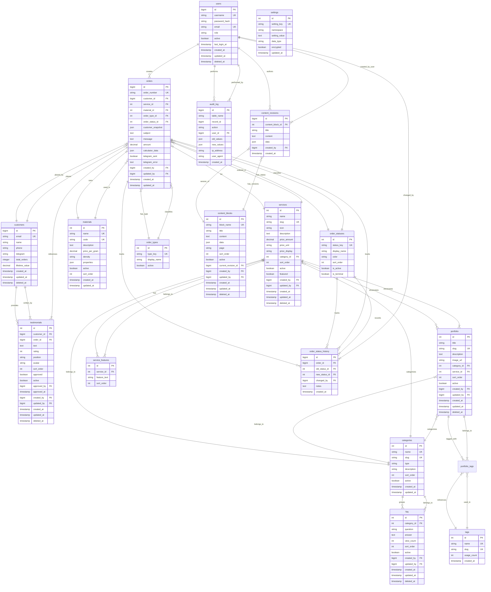

# Target Schema Design
**3D Print Pro Database Redesign**  
**Version:** 3.0 (Target)  
**Date:** January 2025  
**Normalization:** 3NF compliant  
**Status:** Design Phase

---

## Table of Contents
1. [Executive Summary](#executive-summary)
2. [Design Principles](#design-principles)
3. [Entity Relationship Diagram](#entity-relationship-diagram)
4. [Core Entities](#core-entities)
5. [Lookup Tables](#lookup-tables)
6. [Junction Tables](#junction-tables)
7. [Audit & History Tables](#audit--history-tables)
8. [Indexing Strategy](#indexing-strategy)
9. [Constraints & Rules](#constraints--rules)
10. [Audit Trail Approach](#audit-trail-approach)
11. [Soft Delete Strategy](#soft-delete-strategy)
12. [Caching Considerations](#caching-considerations)
13. [Legacy Field Mapping](#legacy-field-mapping)
14. [Migration Strategy](#migration-strategy)
15. [Open Questions](#open-questions)

---

## Executive Summary

This document defines a fully normalized (3NF+) relational schema for the 3D Print Pro platform, addressing all 25 gaps identified in the current state audit. The target schema introduces **19 tables** (up from 7), establishes **32 foreign key relationships**, and implements comprehensive audit logging and soft delete support.

### Key Improvements
- ✅ **Full referential integrity** with foreign keys and cascading rules
- ✅ **Separated concerns** - dedicated users, customers, and settings tables
- ✅ **Normalized data** - categories, statuses, features, and tags extracted to lookup tables
- ✅ **Audit trail** - per-table timestamps + centralized change log
- ✅ **Soft delete support** - recoverable deletions for content entities
- ✅ **Performance optimized** - 45+ indexes including 15 composite indexes
- ✅ **Type safety** - proper data types (DECIMAL for prices, proper ENUMs replaced)
- ✅ **Extensibility** - lookup tables allow admin-managed values without schema changes

### Statistics
| Metric | Current (v2.0) | Target (v3.0) | Improvement |
|--------|----------------|---------------|-------------|
| Tables | 7 | 19 | +171% |
| Foreign Keys | 0 | 32 | ∞ |
| Indexes | 38 | 65 | +71% |
| Normalized (3NF) | ❌ | ✅ | 100% |
| Audit Trail | Partial | Complete | 100% |
| Soft Delete | ❌ | ✅ | 100% |

---

## Design Principles

### 1. Normalization Standards
**Target:** Third Normal Form (3NF) minimum, with selective denormalization for performance

**1NF Compliance:**
- All columns contain atomic values (no JSON arrays for searchable data)
- No repeating groups
- Each table has a primary key

**2NF Compliance:**
- All non-key attributes depend on the entire primary key
- No partial dependencies

**3NF Compliance:**
- No transitive dependencies
- All non-key attributes depend directly on the primary key

**Strategic Denormalization:**
- `orders.customer_snapshot` JSON - preserves customer info at order time
- `orders.calculator_data` JSON - rarely queried, complex nested structure
- Computed columns with triggers where read performance critical

### 2. Data Integrity
- Foreign keys with explicit CASCADE rules on all relationships
- CHECK constraints for business rules (rating ranges, positive amounts)
- UNIQUE constraints on natural keys (email, slug)
- NOT NULL enforcement where business logic requires
- Default values align with business expectations

### 3. Security & Compliance
- Separate `users` table for authentication (isolated from settings)
- Encrypted storage approach for sensitive credentials
- Audit log captures all critical changes
- Row-level ownership tracking (created_by, updated_by)
- Soft deletes prevent accidental data loss

### 4. Performance
- Composite indexes for common query patterns (WHERE + ORDER BY)
- Foreign key columns always indexed
- Full-text indexes on searchable content
- Selective JSON columns (only when not queried)
- Prepared for caching layer (Redis-friendly structure)

### 5. Maintainability
- Consistent naming conventions (snake_case, plural table names)
- Self-documenting column names
- Lookup tables for extensible values (no ALTER TABLE for new statuses)
- Comprehensive inline comments in DDL
- Migration-friendly (no destructive changes to existing data)

---

## Entity Relationship Diagram



---

## Core Entities

### 1. users
**Purpose:** Administrator and system user authentication and authorization  
**Replaces:** `settings.admin_login`, `settings.admin_password_hash`  
**Normalization:** 3NF compliant

```sql
CREATE TABLE users (
    id BIGINT UNSIGNED AUTO_INCREMENT PRIMARY KEY,
    username VARCHAR(100) NOT NULL UNIQUE,
    password_hash VARCHAR(255) NOT NULL,
    email VARCHAR(255) NOT NULL UNIQUE,
    full_name VARCHAR(255),
    role ENUM('super_admin', 'admin', 'manager', 'viewer') NOT NULL DEFAULT 'admin',
    active BOOLEAN NOT NULL DEFAULT TRUE,
    last_login_at TIMESTAMP NULL,
    login_attempts INT UNSIGNED DEFAULT 0,
    locked_until TIMESTAMP NULL,
    created_at TIMESTAMP NOT NULL DEFAULT CURRENT_TIMESTAMP,
    updated_at TIMESTAMP NOT NULL DEFAULT CURRENT_TIMESTAMP ON UPDATE CURRENT_TIMESTAMP,
    deleted_at TIMESTAMP NULL,
    
    INDEX idx_username (username),
    INDEX idx_email (email),
    INDEX idx_active (active),
    INDEX idx_role (role),
    INDEX idx_deleted_at (deleted_at)
) ENGINE=InnoDB DEFAULT CHARSET=utf8mb4 COLLATE=utf8mb4_unicode_ci;
```

**Columns:**
- `id` - BIGINT for future scalability (millions of audit log entries reference this)
- `username` - Unique login identifier (NOT email for flexibility)
- `password_hash` - Bcrypt/Argon2 hash (never plain text)
- `email` - Contact email (required, unique, for password resets)
- `full_name` - Display name in admin UI
- `role` - RBAC support (super_admin, admin, manager, viewer)
- `active` - Quick enable/disable without deletion
- `last_login_at` - Track user activity
- `login_attempts`, `locked_until` - Brute force protection
- `deleted_at` - Soft delete support

**Constraints:**
- `username` and `email` must be unique
- `password_hash` minimum length 60 chars (bcrypt requirement)
- `login_attempts` resets to 0 on successful login

**Indexes:**
- Primary: `id` (clustered)
- Unique: `username`, `email`
- Filter: `active`, `deleted_at`
- Query: `role` (for permission checks)

---

### 2. customers
**Purpose:** Unified customer records with order history  
**Replaces:** Denormalized customer data in `orders` table  
**Normalization:** 3NF compliant

```sql
CREATE TABLE customers (
    id BIGINT UNSIGNED AUTO_INCREMENT PRIMARY KEY,
    email VARCHAR(255) UNIQUE,
    name VARCHAR(255) NOT NULL,
    phone VARCHAR(20) NOT NULL,
    telegram VARCHAR(100),
    notes TEXT,
    total_orders INT UNSIGNED DEFAULT 0,
    lifetime_value DECIMAL(12,2) DEFAULT 0.00,
    preferred_contact ENUM('email', 'phone', 'telegram') DEFAULT 'phone',
    created_at TIMESTAMP NOT NULL DEFAULT CURRENT_TIMESTAMP,
    updated_at TIMESTAMP NOT NULL DEFAULT CURRENT_TIMESTAMP ON UPDATE CURRENT_TIMESTAMP,
    deleted_at TIMESTAMP NULL,
    
    INDEX idx_email (email),
    INDEX idx_phone (phone),
    INDEX idx_deleted_at (deleted_at),
    INDEX idx_lifetime_value (lifetime_value),
    FULLTEXT INDEX ft_customer_search (name, email, phone)
) ENGINE=InnoDB DEFAULT CHARSET=utf8mb4 COLLATE=utf8mb4_unicode_ci;
```

**Columns:**
- `id` - BIGINT for large customer base
- `email` - Optional (some customers only provide phone), unique when present
- `name` - Customer full name (required)
- `phone` - Primary contact (required, indexed for quick lookup)
- `telegram` - Optional Telegram handle (@username)
- `notes` - Admin notes about customer
- `total_orders` - Cached count (updated via trigger)
- `lifetime_value` - Total spent (updated via trigger)
- `preferred_contact` - How customer prefers communication

**Constraints:**
- `email` unique when not NULL
- `phone` required and validated format
- `total_orders` and `lifetime_value` auto-updated via triggers

**Indexes:**
- Primary: `id`
- Unique: `email` (partial - only when not NULL)
- Lookup: `phone` (high query frequency)
- Analytics: `lifetime_value` (for VIP customer reports)
- Full-text: Search across name, email, phone

**Triggers:**
- `AFTER INSERT ON orders` → increment `total_orders`, add `amount` to `lifetime_value`
- `AFTER UPDATE ON orders` → recalculate `lifetime_value` if amount changed
- `AFTER DELETE ON orders` → decrement `total_orders`, subtract `amount` from `lifetime_value`

---

### 3. categories
**Purpose:** Shared taxonomy for services, portfolio, and FAQ  
**Replaces:** `services.category`, `portfolio.category` (VARCHAR)  
**Normalization:** 3NF compliant

```sql
CREATE TABLE categories (
    id INT UNSIGNED AUTO_INCREMENT PRIMARY KEY,
    name VARCHAR(100) NOT NULL,
    slug VARCHAR(100) NOT NULL UNIQUE,
    type ENUM('service', 'portfolio', 'faq') NOT NULL,
    description TEXT,
    icon VARCHAR(100),
    sort_order INT DEFAULT 0,
    active BOOLEAN DEFAULT TRUE,
    created_at TIMESTAMP NOT NULL DEFAULT CURRENT_TIMESTAMP,
    updated_at TIMESTAMP NOT NULL DEFAULT CURRENT_TIMESTAMP ON UPDATE CURRENT_TIMESTAMP,
    
    UNIQUE KEY uk_type_slug (type, slug),
    INDEX idx_type_active (type, active),
    INDEX idx_sort (sort_order)
) ENGINE=InnoDB DEFAULT CHARSET=utf8mb4 COLLATE=utf8mb4_unicode_ci;
```

**Columns:**
- `id` - INT sufficient for small taxonomy (unlikely >10,000 categories)
- `name` - Display name (e.g., "FDM Печать", "Прототипирование")
- `slug` - URL-friendly identifier (e.g., "fdm-printing")
- `type` - Category context (service, portfolio, or faq)
- `description` - Optional category description
- `icon` - Icon class or path for UI
- `sort_order` - Display order in dropdowns/menus

**Constraints:**
- `slug` must be unique within each `type`
- `sort_order` defaults to 0

**Indexes:**
- Primary: `id`
- Unique: `slug`, composite `(type, slug)`
- Query: `(type, active)` - most queries filter by both
- Sort: `sort_order`

---

### 4. services
**Purpose:** Service offerings with structured pricing  
**Replaces:** Original `services` table with improvements  
**Normalization:** 3NF compliant

```sql
CREATE TABLE services (
    id INT UNSIGNED AUTO_INCREMENT PRIMARY KEY,
    name VARCHAR(255) NOT NULL,
    slug VARCHAR(255) NOT NULL UNIQUE,
    icon VARCHAR(255),
    description TEXT,
    price_amount DECIMAL(10,2),
    price_unit ENUM('per_gram', 'per_hour', 'per_model', 'per_project', 'custom') DEFAULT 'custom',
    price_display VARCHAR(100),
    category_id INT UNSIGNED,
    sort_order INT DEFAULT 0,
    active BOOLEAN DEFAULT TRUE,
    featured BOOLEAN DEFAULT FALSE,
    meta_title VARCHAR(255),
    meta_description VARCHAR(500),
    created_by BIGINT UNSIGNED,
    updated_by BIGINT UNSIGNED,
    created_at TIMESTAMP NOT NULL DEFAULT CURRENT_TIMESTAMP,
    updated_at TIMESTAMP NOT NULL DEFAULT CURRENT_TIMESTAMP ON UPDATE CURRENT_TIMESTAMP,
    deleted_at TIMESTAMP NULL,
    
    FOREIGN KEY (category_id) REFERENCES categories(id) ON DELETE SET NULL,
    FOREIGN KEY (created_by) REFERENCES users(id) ON DELETE SET NULL,
    FOREIGN KEY (updated_by) REFERENCES users(id) ON DELETE SET NULL,
    
    INDEX idx_category_active_sort (category_id, active, sort_order),
    INDEX idx_featured (featured),
    INDEX idx_slug (slug),
    INDEX idx_deleted_at (deleted_at),
    FULLTEXT INDEX ft_service_search (name, description)
) ENGINE=InnoDB DEFAULT CHARSET=utf8mb4 COLLATE=utf8mb4_unicode_ci;
```

**Columns:**
- `price_amount` - Numeric price for filtering/sorting (NEW)
- `price_unit` - Price unit type (NEW)
- `price_display` - Formatted display string (preserves legacy "от 50₽/г")
- `category_id` - FK to categories (NEW, replaces VARCHAR)
- `meta_title`, `meta_description` - SEO metadata (NEW)
- `created_by`, `updated_by` - Audit trail (NEW)
- `deleted_at` - Soft delete (NEW)

**Changes from Legacy:**
- `features` JSON → normalized to `service_features` table
- `category` VARCHAR → `category_id` FK
- `price` VARCHAR → split into `price_amount`, `price_unit`, `price_display`

**Constraints:**
- `price_amount >= 0` when not NULL
- `sort_order >= 0`
- `slug` unique across all services

**Indexes:**
- Primary: `id`
- Composite: `(category_id, active, sort_order)` - main listing query
- Unique: `slug`
- Filter: `featured`, `deleted_at`
- Full-text: `(name, description)` for search

---

### 5. service_features
**Purpose:** Normalized service features (replaces JSON array)  
**Replaces:** `services.features` JSON column  
**Normalization:** 3NF compliant

```sql
CREATE TABLE service_features (
    id INT UNSIGNED AUTO_INCREMENT PRIMARY KEY,
    service_id INT UNSIGNED NOT NULL,
    feature_text VARCHAR(500) NOT NULL,
    sort_order INT DEFAULT 0,
    
    FOREIGN KEY (service_id) REFERENCES services(id) ON DELETE CASCADE,
    
    INDEX idx_service_sort (service_id, sort_order)
) ENGINE=InnoDB DEFAULT CHARSET=utf8mb4 COLLATE=utf8mb4_unicode_ci;
```

**Columns:**
- `service_id` - FK to parent service
- `feature_text` - Individual feature description
- `sort_order` - Display order

**Constraints:**
- CASCADE DELETE - features deleted with service

**Indexes:**
- Composite: `(service_id, sort_order)` - always queried together

**Example Migration:**
```sql
-- OLD: services.features = ["Высокая точность", "Быстрая печать"]
-- NEW:
-- service_features: (service_id=1, feature_text="Высокая точность", sort_order=0)
-- service_features: (service_id=1, feature_text="Быстрая печать", sort_order=1)
```

---

### 6. materials
**Purpose:** 3D printing materials catalog (for calculator and orders)  
**Replaces:** Hardcoded material values in calculator  
**Normalization:** 3NF compliant

```sql
CREATE TABLE materials (
    id INT UNSIGNED AUTO_INCREMENT PRIMARY KEY,
    name VARCHAR(100) NOT NULL,
    code VARCHAR(50) NOT NULL UNIQUE,
    description TEXT,
    price_per_gram DECIMAL(8,4) NOT NULL,
    density DECIMAL(6,3),
    color_options JSON,
    properties JSON,
    active BOOLEAN DEFAULT TRUE,
    sort_order INT DEFAULT 0,
    created_at TIMESTAMP NOT NULL DEFAULT CURRENT_TIMESTAMP,
    updated_at TIMESTAMP NOT NULL DEFAULT CURRENT_TIMESTAMP ON UPDATE CURRENT_TIMESTAMP,
    
    UNIQUE KEY uk_name (name),
    INDEX idx_active_sort (active, sort_order),
    INDEX idx_code (code)
) ENGINE=InnoDB DEFAULT CHARSET=utf8mb4 COLLATE=utf8mb4_unicode_ci;
```

**Columns:**
- `name` - Display name (e.g., "PLA", "ABS", "Resin")
- `code` - Short code for internal use (e.g., "PLA", "ABS")
- `description` - Material properties and use cases
- `price_per_gram` - Base price for calculator
- `density` - For volume-to-weight calculations
- `color_options` - JSON array of available colors
- `properties` - JSON for flexible attributes (temperature, strength, etc.)

**Constraints:**
- `name` and `code` unique
- `price_per_gram > 0`

**Indexes:**
- Composite: `(active, sort_order)` - calculator dropdown query

---

### 7. portfolio
**Purpose:** Project showcase with relationships  
**Replaces:** Original `portfolio` table with improvements  
**Normalization:** 3NF compliant

```sql
CREATE TABLE portfolio (
    id INT UNSIGNED AUTO_INCREMENT PRIMARY KEY,
    title VARCHAR(255) NOT NULL,
    slug VARCHAR(255) NOT NULL UNIQUE,
    description TEXT,
    image_url VARCHAR(500),
    category_id INT UNSIGNED,
    service_id INT UNSIGNED,
    sort_order INT DEFAULT 0,
    active BOOLEAN DEFAULT TRUE,
    views INT UNSIGNED DEFAULT 0,
    meta_title VARCHAR(255),
    meta_description VARCHAR(500),
    created_by BIGINT UNSIGNED,
    updated_by BIGINT UNSIGNED,
    created_at TIMESTAMP NOT NULL DEFAULT CURRENT_TIMESTAMP,
    updated_at TIMESTAMP NOT NULL DEFAULT CURRENT_TIMESTAMP ON UPDATE CURRENT_TIMESTAMP,
    deleted_at TIMESTAMP NULL,
    
    FOREIGN KEY (category_id) REFERENCES categories(id) ON DELETE SET NULL,
    FOREIGN KEY (service_id) REFERENCES services(id) ON DELETE SET NULL,
    FOREIGN KEY (created_by) REFERENCES users(id) ON DELETE SET NULL,
    FOREIGN KEY (updated_by) REFERENCES users(id) ON DELETE SET NULL,
    
    INDEX idx_category_active (category_id, active),
    INDEX idx_service_id (service_id),
    INDEX idx_slug (slug),
    INDEX idx_deleted_at (deleted_at),
    FULLTEXT INDEX ft_portfolio_search (title, description)
) ENGINE=InnoDB DEFAULT CHARSET=utf8mb4 COLLATE=utf8mb4_unicode_ci;
```

**Columns:**
- `slug` - SEO-friendly URL identifier (NEW)
- `category_id` - FK to categories (replaces VARCHAR)
- `service_id` - Link to service used (NEW)
- `views` - Page view counter (NEW)
- `meta_title`, `meta_description` - SEO metadata (NEW)
- `created_by`, `updated_by` - Audit trail (NEW)

**Changes from Legacy:**
- `tags` JSON → normalized to `portfolio_tags` + `tags` tables
- `category` VARCHAR → `category_id` FK
- Added `slug` for SEO
- Added `service_id` relationship

---

### 8. tags
**Purpose:** Reusable tag taxonomy for portfolio  
**Replaces:** `portfolio.tags` JSON column  
**Normalization:** 3NF compliant

```sql
CREATE TABLE tags (
    id INT UNSIGNED AUTO_INCREMENT PRIMARY KEY,
    name VARCHAR(100) NOT NULL UNIQUE,
    slug VARCHAR(100) NOT NULL UNIQUE,
    usage_count INT UNSIGNED DEFAULT 0,
    created_at TIMESTAMP NOT NULL DEFAULT CURRENT_TIMESTAMP,
    
    INDEX idx_slug (slug),
    INDEX idx_usage (usage_count)
) ENGINE=InnoDB DEFAULT CHARSET=utf8mb4 COLLATE=utf8mb4_unicode_ci;
```

**Columns:**
- `name` - Tag display name (e.g., "Архитектура", "Прототип")
- `slug` - URL-friendly version
- `usage_count` - Auto-updated count (via trigger)

---

### 9. portfolio_tags
**Purpose:** Many-to-many relationship between portfolio and tags  
**Replaces:** `portfolio.tags` JSON column  
**Normalization:** 3NF compliant (junction table)

```sql
CREATE TABLE portfolio_tags (
    id INT UNSIGNED AUTO_INCREMENT PRIMARY KEY,
    portfolio_id INT UNSIGNED NOT NULL,
    tag_id INT UNSIGNED NOT NULL,
    
    FOREIGN KEY (portfolio_id) REFERENCES portfolio(id) ON DELETE CASCADE,
    FOREIGN KEY (tag_id) REFERENCES tags(id) ON DELETE CASCADE,
    
    UNIQUE KEY uk_portfolio_tag (portfolio_id, tag_id),
    INDEX idx_tag_portfolio (tag_id, portfolio_id)
) ENGINE=InnoDB DEFAULT CHARSET=utf8mb4 COLLATE=utf8mb4_unicode_ci;
```

**Constraints:**
- Composite unique: `(portfolio_id, tag_id)` - prevent duplicates
- CASCADE DELETE on both FKs

**Triggers:**
- `AFTER INSERT` → increment `tags.usage_count`
- `AFTER DELETE` → decrement `tags.usage_count`

---

### 10. orders
**Purpose:** Customer orders and contact inquiries  
**Replaces:** Original `orders` table with relationships  
**Normalization:** 3NF with strategic denormalization

```sql
CREATE TABLE orders (
    id BIGINT UNSIGNED AUTO_INCREMENT PRIMARY KEY,
    order_number VARCHAR(50) NOT NULL UNIQUE,
    customer_id BIGINT UNSIGNED NOT NULL,
    service_id INT UNSIGNED,
    material_id INT UNSIGNED,
    order_type_id INT UNSIGNED NOT NULL,
    order_status_id INT UNSIGNED NOT NULL,
    customer_snapshot JSON,
    subject VARCHAR(255),
    message TEXT,
    amount DECIMAL(12,2) DEFAULT 0.00,
    calculator_data JSON,
    telegram_sent BOOLEAN DEFAULT FALSE,
    telegram_error TEXT,
    created_by BIGINT UNSIGNED,
    updated_by BIGINT UNSIGNED,
    created_at TIMESTAMP NOT NULL DEFAULT CURRENT_TIMESTAMP,
    updated_at TIMESTAMP NOT NULL DEFAULT CURRENT_TIMESTAMP ON UPDATE CURRENT_TIMESTAMP,
    
    FOREIGN KEY (customer_id) REFERENCES customers(id) ON DELETE RESTRICT,
    FOREIGN KEY (service_id) REFERENCES services(id) ON DELETE SET NULL,
    FOREIGN KEY (material_id) REFERENCES materials(id) ON DELETE SET NULL,
    FOREIGN KEY (order_type_id) REFERENCES order_types(id) ON DELETE RESTRICT,
    FOREIGN KEY (order_status_id) REFERENCES order_statuses(id) ON DELETE RESTRICT,
    FOREIGN KEY (created_by) REFERENCES users(id) ON DELETE SET NULL,
    FOREIGN KEY (updated_by) REFERENCES users(id) ON DELETE SET NULL,
    
    INDEX idx_customer_created (customer_id, created_at DESC),
    INDEX idx_status_created (order_status_id, created_at DESC),
    INDEX idx_order_number (order_number),
    INDEX idx_type_status (order_type_id, order_status_id),
    FULLTEXT INDEX ft_order_search (subject, message)
) ENGINE=InnoDB DEFAULT CHARSET=utf8mb4 COLLATE=utf8mb4_unicode_ci;
```

**Columns:**
- `id` - BIGINT for scalability (high volume table)
- `customer_id` - FK to customers (NEW, replaces embedded data)
- `service_id` - FK to services (replaces VARCHAR)
- `material_id` - FK to materials (NEW)
- `order_type_id` - FK to order_types (replaces ENUM)
- `order_status_id` - FK to order_statuses (replaces ENUM)
- `customer_snapshot` - JSON snapshot of customer data at order time (denormalized for history)
- `amount` - DECIMAL(12,2) for larger orders

**Changes from Legacy:**
- `name`, `email`, `phone`, `telegram` → `customer_id` FK + `customer_snapshot` JSON
- `type` ENUM → `order_type_id` FK
- `status` ENUM → `order_status_id` FK
- `service` VARCHAR → `service_id` FK
- Added `material_id` FK
- No soft delete (orders are permanent records)

**Constraints:**
- `amount >= 0`
- `customer_id` RESTRICT - cannot delete customer with orders
- `service_id`, `material_id` SET NULL - preserve order if service/material deleted
- `order_type_id`, `order_status_id` RESTRICT - cannot delete referenced lookups

**Indexes:**
- Primary: `id`
- Composite: `(customer_id, created_at)` - customer order history
- Composite: `(order_status_id, created_at)` - status dashboard
- Composite: `(order_type_id, order_status_id)` - filtered views
- Full-text: `(subject, message)` for search

---

### 11. order_types
**Purpose:** Extensible order type taxonomy  
**Replaces:** `orders.type` ENUM  
**Normalization:** 3NF compliant

```sql
CREATE TABLE order_types (
    id INT UNSIGNED AUTO_INCREMENT PRIMARY KEY,
    type_key VARCHAR(50) NOT NULL UNIQUE,
    display_name VARCHAR(100) NOT NULL,
    description TEXT,
    active BOOLEAN DEFAULT TRUE,
    sort_order INT DEFAULT 0,
    
    INDEX idx_active (active)
) ENGINE=InnoDB DEFAULT CHARSET=utf8mb4 COLLATE=utf8mb4_unicode_ci;

-- Seed data
INSERT INTO order_types (type_key, display_name, description) VALUES
('order', 'Заказ', 'Заказ на печать с заполненными параметрами калькулятора'),
('contact', 'Обращение', 'Контактная форма без расчета стоимости'),
('consultation', 'Консультация', 'Запрос на консультацию'),
('custom', 'Индивидуальный', 'Индивидуальный заказ по ТЗ');
```

**Benefits:**
- Add new types without ALTER TABLE
- Admin UI can manage types
- Store metadata (description, sort order)

---

### 12. order_statuses
**Purpose:** Extensible order status workflow  
**Replaces:** `orders.status` ENUM  
**Normalization:** 3NF compliant

```sql
CREATE TABLE order_statuses (
    id INT UNSIGNED AUTO_INCREMENT PRIMARY KEY,
    status_key VARCHAR(50) NOT NULL UNIQUE,
    display_name VARCHAR(100) NOT NULL,
    color VARCHAR(20) DEFAULT '#6c757d',
    description TEXT,
    is_active BOOLEAN DEFAULT TRUE,
    is_terminal BOOLEAN DEFAULT FALSE,
    sort_order INT DEFAULT 0,
    
    INDEX idx_active (is_active)
) ENGINE=InnoDB DEFAULT CHARSET=utf8mb4 COLLATE=utf8mb4_unicode_ci;

-- Seed data
INSERT INTO order_statuses (status_key, display_name, color, is_terminal, sort_order) VALUES
('new', 'Новый', '#007bff', FALSE, 10),
('processing', 'В работе', '#ffc107', FALSE, 20),
('pending_approval', 'Ожидает подтверждения', '#17a2b8', FALSE, 30),
('completed', 'Выполнен', '#28a745', TRUE, 40),
('cancelled', 'Отменен', '#dc3545', TRUE, 50),
('on_hold', 'Приостановлен', '#6c757d', FALSE, 60);
```

**Columns:**
- `status_key` - Internal identifier (code uses this)
- `display_name` - User-facing name
- `color` - UI color code (Bootstrap colors)
- `is_terminal` - Status is final (no further transitions)
- `sort_order` - Display order in dropdowns

**Benefits:**
- Add new statuses without schema changes
- Store UI metadata (color)
- Track workflow logic (is_terminal)

---

### 13. order_status_history
**Purpose:** Audit trail for order status changes  
**Replaces:** Nothing (NEW feature)  
**Normalization:** 3NF compliant

```sql
CREATE TABLE order_status_history (
    id BIGINT UNSIGNED AUTO_INCREMENT PRIMARY KEY,
    order_id BIGINT UNSIGNED NOT NULL,
    old_status_id INT UNSIGNED,
    new_status_id INT UNSIGNED NOT NULL,
    changed_by BIGINT UNSIGNED,
    notes TEXT,
    created_at TIMESTAMP NOT NULL DEFAULT CURRENT_TIMESTAMP,
    
    FOREIGN KEY (order_id) REFERENCES orders(id) ON DELETE CASCADE,
    FOREIGN KEY (old_status_id) REFERENCES order_statuses(id) ON DELETE SET NULL,
    FOREIGN KEY (new_status_id) REFERENCES order_statuses(id) ON DELETE RESTRICT,
    FOREIGN KEY (changed_by) REFERENCES users(id) ON DELETE SET NULL,
    
    INDEX idx_order_created (order_id, created_at DESC),
    INDEX idx_changed_by (changed_by)
) ENGINE=InnoDB DEFAULT CHARSET=utf8mb4 COLLATE=utf8mb4_unicode_ci;
```

**Columns:**
- `old_status_id` - Previous status (NULL for first status)
- `new_status_id` - New status
- `changed_by` - User who made the change (NULL for system)
- `notes` - Optional reason/comment

**Trigger:**
```sql
-- Automatically log status changes
DELIMITER //
CREATE TRIGGER order_status_change_logger
AFTER UPDATE ON orders
FOR EACH ROW
BEGIN
    IF OLD.order_status_id != NEW.order_status_id THEN
        INSERT INTO order_status_history (order_id, old_status_id, new_status_id, changed_by)
        VALUES (NEW.id, OLD.order_status_id, NEW.order_status_id, NEW.updated_by);
    END IF;
END//
DELIMITER ;
```

---

### 14. testimonials
**Purpose:** Customer reviews with verification  
**Replaces:** Original `testimonials` table with relationships  
**Normalization:** 3NF compliant

```sql
CREATE TABLE testimonials (
    id INT UNSIGNED AUTO_INCREMENT PRIMARY KEY,
    customer_id BIGINT UNSIGNED,
    order_id BIGINT UNSIGNED,
    text TEXT NOT NULL,
    rating INT NOT NULL DEFAULT 5,
    position VARCHAR(255),
    avatar VARCHAR(500),
    sort_order INT DEFAULT 0,
    approved BOOLEAN DEFAULT FALSE,
    approved_by BIGINT UNSIGNED,
    approved_at TIMESTAMP NULL,
    active BOOLEAN DEFAULT TRUE,
    created_by BIGINT UNSIGNED,
    updated_by BIGINT UNSIGNED,
    created_at TIMESTAMP NOT NULL DEFAULT CURRENT_TIMESTAMP,
    updated_at TIMESTAMP NOT NULL DEFAULT CURRENT_TIMESTAMP ON UPDATE CURRENT_TIMESTAMP,
    deleted_at TIMESTAMP NULL,
    
    FOREIGN KEY (customer_id) REFERENCES customers(id) ON DELETE SET NULL,
    FOREIGN KEY (order_id) REFERENCES orders(id) ON DELETE SET NULL,
    FOREIGN KEY (approved_by) REFERENCES users(id) ON DELETE SET NULL,
    FOREIGN KEY (created_by) REFERENCES users(id) ON DELETE SET NULL,
    FOREIGN KEY (updated_by) REFERENCES users(id) ON DELETE SET NULL,
    
    CHECK (rating >= 1 AND rating <= 5),
    
    INDEX idx_approved_active (approved, active),
    INDEX idx_customer_id (customer_id),
    INDEX idx_rating (rating),
    INDEX idx_deleted_at (deleted_at)
) ENGINE=InnoDB DEFAULT CHARSET=utf8mb4 COLLATE=utf8mb4_unicode_ci;
```

**Columns:**
- `customer_id` - FK to customers (NEW)
- `order_id` - FK to orders for verification (NEW)
- `approved` - Default FALSE (CHANGED from TRUE)
- `approved_by` - User who approved (NEW)
- `approved_at` - Approval timestamp (NEW)
- `created_by`, `updated_by` - Audit trail (NEW)

**Changes from Legacy:**
- `name` → `customer_id` FK (can display customer.name)
- `approved` default changed to FALSE
- Added approval workflow tracking

---

### 15. faq
**Purpose:** Frequently asked questions with categories  
**Replaces:** Original `faq` table with relationships  
**Normalization:** 3NF compliant

```sql
CREATE TABLE faq (
    id INT UNSIGNED AUTO_INCREMENT PRIMARY KEY,
    category_id INT UNSIGNED,
    question VARCHAR(500) NOT NULL,
    answer TEXT NOT NULL,
    view_count INT UNSIGNED DEFAULT 0,
    sort_order INT DEFAULT 0,
    active BOOLEAN DEFAULT TRUE,
    created_by BIGINT UNSIGNED,
    updated_by BIGINT UNSIGNED,
    created_at TIMESTAMP NOT NULL DEFAULT CURRENT_TIMESTAMP,
    updated_at TIMESTAMP NOT NULL DEFAULT CURRENT_TIMESTAMP ON UPDATE CURRENT_TIMESTAMP,
    deleted_at TIMESTAMP NULL,
    
    FOREIGN KEY (category_id) REFERENCES categories(id) ON DELETE SET NULL,
    FOREIGN KEY (created_by) REFERENCES users(id) ON DELETE SET NULL,
    FOREIGN KEY (updated_by) REFERENCES users(id) ON DELETE SET NULL,
    
    INDEX idx_category_active (category_id, active),
    INDEX idx_view_count (view_count),
    INDEX idx_deleted_at (deleted_at),
    FULLTEXT INDEX ft_faq_search (question, answer)
) ENGINE=InnoDB DEFAULT CHARSET=utf8mb4 COLLATE=utf8mb4_unicode_ci;
```

**Columns:**
- `category_id` - FK to categories (NEW)
- `view_count` - Track popular questions (NEW)
- `created_by`, `updated_by` - Audit trail (NEW)

**Indexes:**
- Full-text: `(question, answer)` for search (NEW)

---

### 16. content_blocks
**Purpose:** Dynamic page content with versioning  
**Replaces:** Original `content_blocks` table with version support  
**Normalization:** 3NF compliant

```sql
CREATE TABLE content_blocks (
    id INT UNSIGNED AUTO_INCREMENT PRIMARY KEY,
    block_name VARCHAR(255) NOT NULL UNIQUE,
    title VARCHAR(500),
    content LONGTEXT,
    data JSON,
    page VARCHAR(100),
    sort_order INT DEFAULT 0,
    active BOOLEAN DEFAULT TRUE,
    current_revision_id BIGINT UNSIGNED,
    created_by BIGINT UNSIGNED,
    updated_by BIGINT UNSIGNED,
    created_at TIMESTAMP NOT NULL DEFAULT CURRENT_TIMESTAMP,
    updated_at TIMESTAMP NOT NULL DEFAULT CURRENT_TIMESTAMP ON UPDATE CURRENT_TIMESTAMP,
    deleted_at TIMESTAMP NULL,
    
    FOREIGN KEY (created_by) REFERENCES users(id) ON DELETE SET NULL,
    FOREIGN KEY (updated_by) REFERENCES users(id) ON DELETE SET NULL,
    
    INDEX idx_page_sort_active (page, sort_order, active),
    INDEX idx_block_name (block_name),
    INDEX idx_deleted_at (deleted_at)
) ENGINE=InnoDB DEFAULT CHARSET=utf8mb4 COLLATE=utf8mb4_unicode_ci;
```

**Columns:**
- `current_revision_id` - FK to latest revision (NEW)
- `sort_order` - Now indexed (FIX)
- `created_by`, `updated_by` - Audit trail (NEW)

**Changes from Legacy:**
- Added `current_revision_id` for versioning
- Added composite index on `(page, sort_order, active)`

---

### 17. content_revisions
**Purpose:** Version history for content blocks  
**Replaces:** Nothing (NEW feature)  
**Normalization:** 3NF compliant

```sql
CREATE TABLE content_revisions (
    id BIGINT UNSIGNED AUTO_INCREMENT PRIMARY KEY,
    content_block_id INT UNSIGNED NOT NULL,
    title VARCHAR(500),
    content LONGTEXT,
    data JSON,
    revision_notes TEXT,
    created_by BIGINT UNSIGNED,
    created_at TIMESTAMP NOT NULL DEFAULT CURRENT_TIMESTAMP,
    
    FOREIGN KEY (content_block_id) REFERENCES content_blocks(id) ON DELETE CASCADE,
    FOREIGN KEY (created_by) REFERENCES users(id) ON DELETE SET NULL,
    
    INDEX idx_content_created (content_block_id, created_at DESC)
) ENGINE=InnoDB DEFAULT CHARSET=utf8mb4 COLLATE=utf8mb4_unicode_ci;
```

**Columns:**
- `content_block_id` - FK to parent content block
- `revision_notes` - Optional change description
- `created_by` - User who created revision

**Trigger:**
```sql
-- Auto-create revision on content update
DELIMITER //
CREATE TRIGGER content_block_revision_creator
BEFORE UPDATE ON content_blocks
FOR EACH ROW
BEGIN
    IF OLD.content != NEW.content OR OLD.title != NEW.title OR OLD.data != NEW.data THEN
        INSERT INTO content_revisions (content_block_id, title, content, data, created_by)
        VALUES (OLD.id, OLD.title, OLD.content, OLD.data, NEW.updated_by);
    END IF;
END//
DELIMITER ;
```

---

### 18. settings
**Purpose:** Application configuration (credentials removed)  
**Replaces:** Original `settings` table without authentication data  
**Normalization:** 3NF compliant

```sql
CREATE TABLE settings (
    id INT UNSIGNED AUTO_INCREMENT PRIMARY KEY,
    setting_key VARCHAR(100) NOT NULL UNIQUE,
    namespace VARCHAR(50) DEFAULT 'general',
    setting_value TEXT,
    data_type ENUM('string', 'integer', 'boolean', 'json', 'decimal') DEFAULT 'string',
    encrypted BOOLEAN DEFAULT FALSE,
    description TEXT,
    updated_at TIMESTAMP NOT NULL DEFAULT CURRENT_TIMESTAMP ON UPDATE CURRENT_TIMESTAMP,
    
    UNIQUE KEY uk_namespace_key (namespace, setting_key),
    INDEX idx_namespace (namespace)
) ENGINE=InnoDB DEFAULT CHARSET=utf8mb4 COLLATE=utf8mb4_unicode_ci;
```

**Columns:**
- `namespace` - Group related settings (NEW)
  - `telegram.*` - Telegram integration
  - `calculator.*` - Calculator defaults
  - `email.*` - Email configuration
  - `site.*` - Site-wide settings
- `data_type` - Type hint for deserialization (NEW)
- `encrypted` - Flag for encrypted values (NEW)
- `description` - Admin UI help text (NEW)

**Changes from Legacy:**
- Removed `admin_login` and `admin_password_hash` (moved to `users`)
- Added namespace grouping
- Added type metadata

**Example Settings:**
```sql
INSERT INTO settings (namespace, setting_key, setting_value, data_type) VALUES
('telegram', 'bot_token', 'ENCRYPTED_VALUE', 'string'),
('telegram', 'chat_id', '-1001234567890', 'string'),
('telegram', 'notify_new_order', 'true', 'boolean'),
('calculator', 'default_material_id', '1', 'integer'),
('calculator', 'markup_percentage', '15.00', 'decimal'),
('site', 'maintenance_mode', 'false', 'boolean');
```

---

### 19. audit_log
**Purpose:** Centralized audit trail for all critical operations  
**Replaces:** Nothing (NEW feature)  
**Normalization:** 3NF compliant

```sql
CREATE TABLE audit_log (
    id BIGINT UNSIGNED AUTO_INCREMENT PRIMARY KEY,
    table_name VARCHAR(100) NOT NULL,
    record_id BIGINT UNSIGNED NOT NULL,
    action ENUM('INSERT', 'UPDATE', 'DELETE', 'LOGIN', 'LOGOUT') NOT NULL,
    user_id BIGINT UNSIGNED,
    old_values JSON,
    new_values JSON,
    ip_address VARCHAR(45),
    user_agent VARCHAR(500),
    created_at TIMESTAMP NOT NULL DEFAULT CURRENT_TIMESTAMP,
    
    FOREIGN KEY (user_id) REFERENCES users(id) ON DELETE SET NULL,
    
    INDEX idx_table_record (table_name, record_id),
    INDEX idx_user_created (user_id, created_at DESC),
    INDEX idx_action_created (action, created_at DESC),
    INDEX idx_created_at (created_at)
) ENGINE=InnoDB DEFAULT CHARSET=utf8mb4 COLLATE=utf8mb4_unicode_ci;
```

**Columns:**
- `table_name` - Which table was modified
- `record_id` - ID of modified record
- `action` - Operation type
- `user_id` - Who performed action (NULL for system)
- `old_values` - JSON snapshot before change
- `new_values` - JSON snapshot after change
- `ip_address` - Client IP (IPv4 or IPv6)
- `user_agent` - Client browser/app

**Indexes:**
- Composite: `(table_name, record_id)` - record history
- Composite: `(user_id, created_at)` - user activity
- Composite: `(action, created_at)` - action reports
- Single: `created_at` - time-range queries

**Retention Policy:**
- Keep 90 days online
- Archive older records to cold storage
- Partition by month for performance

---

## Lookup Tables

### Summary Table
| Table | Purpose | Rows | Updatable by Admin |
|-------|---------|------|-------------------|
| `categories` | Taxonomy for services/portfolio/FAQ | 10-30 | ✅ Yes |
| `order_statuses` | Order workflow states | 5-10 | ✅ Yes |
| `order_types` | Order classification | 3-5 | ✅ Yes |
| `materials` | 3D printing materials | 10-20 | ✅ Yes |
| `tags` | Portfolio tags | 20-100 | Auto-created |

All lookup tables include:
- ✅ `active` boolean for soft disable
- ✅ `sort_order` for display ordering
- ✅ Audit timestamps

---

## Junction Tables

### Summary Table
| Table | Purpose | Relationship |
|-------|---------|--------------|
| `service_features` | Service → Features | 1:N |
| `portfolio_tags` | Portfolio ↔ Tags | M:N |

Both junction tables use:
- ✅ `ON DELETE CASCADE` - child records deleted with parent
- ✅ Composite indexes on foreign keys
- ✅ Unique constraints to prevent duplicates

---

## Audit & History Tables

### Summary Table
| Table | Purpose | Retention |
|-------|---------|-----------|
| `order_status_history` | Order status changes | Permanent |
| `content_revisions` | Content version history | 90 days |
| `audit_log` | All critical changes | 90 days online, archive older |

### Audit Log Scope
**Logged Operations:**
- ✅ All `INSERT`, `UPDATE`, `DELETE` on:
  - `orders`
  - `users`
  - `customers`
  - `services`
  - `content_blocks`
  - `settings` (critical settings only)
- ✅ Authentication events:
  - `LOGIN`, `LOGOUT`
  - Failed login attempts
  - Password changes

**Not Logged:**
- Read operations (too high volume)
- Non-critical updates (view counts, last_login_at)
- System-generated data (timestamps)

---

## Indexing Strategy

### Index Categories

#### 1. Primary Keys
All tables use auto-increment integer PKs:
- `INT UNSIGNED` for small tables (<1M rows)
- `BIGINT UNSIGNED` for large tables (orders, audit_log, customers)

#### 2. Foreign Keys
**Rule:** All FK columns are indexed automatically by InnoDB
- Single-column FKs: Individual index
- Multi-column FKs: Composite index on FK columns

#### 3. Unique Constraints
Natural keys indexed as UNIQUE:
- `users.username`, `users.email`
- `customers.email` (partial unique - only when not NULL)
- `services.slug`, `portfolio.slug`
- `categories(type, slug)` - composite unique
- `tags.name`, `tags.slug`
- `order_types.type_key`, `order_statuses.status_key`

#### 4. Composite Indexes
Query pattern-driven (WHERE + ORDER BY):
```sql
-- Order dashboard: filter by status, sort by date
CREATE INDEX idx_orders_status_created ON orders(order_status_id, created_at DESC);

-- Customer order history: filter by customer, sort by date
CREATE INDEX idx_orders_customer_created ON orders(customer_id, created_at DESC);

-- Service listing: filter by category and active, sort by sort_order
CREATE INDEX idx_services_cat_active_sort ON services(category_id, active, sort_order);

-- Content blocks: filter by page and active, sort by sort_order
CREATE INDEX idx_content_page_sort_active ON content_blocks(page, sort_order, active);

-- Portfolio: filter by category and active
CREATE INDEX idx_portfolio_category_active ON portfolio(category_id, active);

-- FAQ: filter by category and active
CREATE INDEX idx_faq_category_active ON faq(category_id, active);

-- Audit log: user activity timeline
CREATE INDEX idx_audit_user_created ON audit_log(user_id, created_at DESC);

-- Audit log: table record history
CREATE INDEX idx_audit_table_record ON audit_log(table_name, record_id);
```

#### 5. Full-Text Indexes
For search functionality:
```sql
-- Customer search (name, email, phone)
CREATE FULLTEXT INDEX ft_customer_search ON customers(name, email, phone);

-- Service search (name, description)
CREATE FULLTEXT INDEX ft_service_search ON services(name, description);

-- Portfolio search (title, description)
CREATE FULLTEXT INDEX ft_portfolio_search ON portfolio(title, description);

-- Order search (subject, message)
CREATE FULLTEXT INDEX ft_order_search ON orders(subject, message);

-- FAQ search (question, answer)
CREATE FULLTEXT INDEX ft_faq_search ON faq(question, answer);
```

#### 6. Soft Delete Indexes
All soft-deletable tables:
```sql
CREATE INDEX idx_deleted_at ON {table}(deleted_at);
```
Allows efficient filtering: `WHERE deleted_at IS NULL`

#### 7. Analytics Indexes
For reporting queries:
```sql
-- Customer lifetime value reports
CREATE INDEX idx_customers_lifetime_value ON customers(lifetime_value);

-- Popular FAQ tracking
CREATE INDEX idx_faq_view_count ON faq(view_count);

-- Portfolio views
CREATE INDEX idx_portfolio_views ON portfolio(views);
```

### Index Maintenance
```sql
-- Monthly index optimization
ANALYZE TABLE orders, customers, audit_log;

-- Quarterly index rebuild
OPTIMIZE TABLE orders, customers, audit_log;

-- Monitor index usage
SELECT * FROM sys.schema_unused_indexes
WHERE object_schema = '3dprint_pro';
```

---

## Constraints & Rules

### Foreign Key Cascading Rules

#### CASCADE DELETE
Parent deletion cascades to children:
```sql
-- Delete service → delete service_features
service_features.service_id → services.id ON DELETE CASCADE

-- Delete portfolio → delete portfolio_tags
portfolio_tags.portfolio_id → portfolio.id ON DELETE CASCADE

-- Delete content_block → delete content_revisions
content_revisions.content_block_id → content_blocks.id ON DELETE CASCADE

-- Delete order → delete order_status_history
order_status_history.order_id → orders.id ON DELETE CASCADE
```

#### SET NULL
Parent deletion nulls child reference (preserve child):
```sql
-- Delete user → keep orders (set created_by=NULL)
orders.created_by → users.id ON DELETE SET NULL
orders.updated_by → users.id ON DELETE SET NULL

-- Delete service → keep orders (preserve service_id=NULL, data in customer_snapshot)
orders.service_id → services.id ON DELETE SET NULL

-- Delete category → keep services/portfolio (recategorize manually)
services.category_id → categories.id ON DELETE SET NULL
portfolio.category_id → categories.id ON DELETE SET NULL
```

#### RESTRICT
Prevent parent deletion if children exist:
```sql
-- Cannot delete customer with orders
orders.customer_id → customers.id ON DELETE RESTRICT

-- Cannot delete order_status/order_type if referenced
orders.order_status_id → order_statuses.id ON DELETE RESTRICT
orders.order_type_id → order_types.id ON DELETE RESTRICT
```

### CHECK Constraints

```sql
-- Positive amounts
ALTER TABLE orders ADD CONSTRAINT chk_order_amount CHECK (amount >= 0);
ALTER TABLE materials ADD CONSTRAINT chk_material_price CHECK (price_per_gram > 0);
ALTER TABLE services ADD CONSTRAINT chk_service_price CHECK (price_amount IS NULL OR price_amount >= 0);

-- Valid ratings
ALTER TABLE testimonials ADD CONSTRAINT chk_rating CHECK (rating >= 1 AND rating <= 5);

-- Sort order non-negative
ALTER TABLE services ADD CONSTRAINT chk_service_sort CHECK (sort_order >= 0);
ALTER TABLE portfolio ADD CONSTRAINT chk_portfolio_sort CHECK (sort_order >= 0);
```

### Unique Constraints

```sql
-- Prevent duplicate customer emails
ALTER TABLE customers ADD UNIQUE KEY uk_email (email);

-- Prevent duplicate tags
ALTER TABLE tags ADD UNIQUE KEY uk_name (name);
ALTER TABLE tags ADD UNIQUE KEY uk_slug (slug);

-- Prevent duplicate portfolio-tag associations
ALTER TABLE portfolio_tags ADD UNIQUE KEY uk_portfolio_tag (portfolio_id, tag_id);

-- Prevent duplicate category slugs within type
ALTER TABLE categories ADD UNIQUE KEY uk_type_slug (type, slug);
```

### Default Values

```sql
-- Boolean defaults
active BOOLEAN DEFAULT TRUE
approved BOOLEAN DEFAULT FALSE  -- Changed from TRUE
is_active BOOLEAN DEFAULT TRUE
encrypted BOOLEAN DEFAULT FALSE
telegram_sent BOOLEAN DEFAULT FALSE

-- Numeric defaults
sort_order INT DEFAULT 0
view_count INT UNSIGNED DEFAULT 0
total_orders INT UNSIGNED DEFAULT 0
lifetime_value DECIMAL(12,2) DEFAULT 0.00
rating INT DEFAULT 5
login_attempts INT UNSIGNED DEFAULT 0

-- Timestamp defaults
created_at TIMESTAMP NOT NULL DEFAULT CURRENT_TIMESTAMP
updated_at TIMESTAMP NOT NULL DEFAULT CURRENT_TIMESTAMP ON UPDATE CURRENT_TIMESTAMP
```

---

## Audit Trail Approach

### Two-Layer Strategy

#### Layer 1: Per-Table Audit Columns
**Applied to:** All tables (except purely system tables)

```sql
created_at TIMESTAMP NOT NULL DEFAULT CURRENT_TIMESTAMP
created_by BIGINT UNSIGNED REFERENCES users(id) ON DELETE SET NULL
updated_at TIMESTAMP NOT NULL DEFAULT CURRENT_TIMESTAMP ON UPDATE CURRENT_TIMESTAMP
updated_by BIGINT UNSIGNED REFERENCES users(id) ON DELETE SET NULL
deleted_at TIMESTAMP NULL  -- Soft delete
```

**Usage:**
- `created_at` - When record was created
- `created_by` - Which user created it (NULL for system/API)
- `updated_at` - Last modification timestamp (auto-updated)
- `updated_by` - Which user last modified it
- `deleted_at` - Soft delete timestamp (NULL = active)

**Implementation:**
```php
// In Database class, auto-inject audit fields
public function insertRecord($table, $data) {
    global $currentUser; // From session
    $data['created_by'] = $currentUser->id ?? null;
    $data['created_at'] = date('Y-m-d H:i:s');
    // ... execute INSERT
}

public function updateRecord($table, $id, $data) {
    global $currentUser;
    $data['updated_by'] = $currentUser->id ?? null;
    // ... execute UPDATE
}
```

#### Layer 2: Centralized Audit Log
**Applied to:** Critical operations only

**Logged Operations:**
- All changes to `orders`, `users`, `settings`
- Admin changes to `services`, `content_blocks`
- Authentication events (login, logout, password change)

**Logged Data:**
- Before/after values as JSON
- User ID, IP address, user agent
- Timestamp

**Implementation via Triggers:**
```sql
-- Example: Audit orders table
DELIMITER //
CREATE TRIGGER orders_audit_insert
AFTER INSERT ON orders
FOR EACH ROW
BEGIN
    INSERT INTO audit_log (table_name, record_id, action, user_id, new_values, created_at)
    VALUES ('orders', NEW.id, 'INSERT', NEW.created_by, JSON_OBJECT(
        'order_number', NEW.order_number,
        'customer_id', NEW.customer_id,
        'amount', NEW.amount,
        'order_status_id', NEW.order_status_id
    ), NOW());
END//

CREATE TRIGGER orders_audit_update
AFTER UPDATE ON orders
FOR EACH ROW
BEGIN
    INSERT INTO audit_log (table_name, record_id, action, user_id, old_values, new_values, created_at)
    VALUES ('orders', NEW.id, 'UPDATE', NEW.updated_by, JSON_OBJECT(
        'order_status_id', OLD.order_status_id,
        'amount', OLD.amount
    ), JSON_OBJECT(
        'order_status_id', NEW.order_status_id,
        'amount', NEW.amount
    ), NOW());
END//

CREATE TRIGGER orders_audit_delete
AFTER DELETE ON orders
FOR EACH ROW
BEGIN
    INSERT INTO audit_log (table_name, record_id, action, old_values, created_at)
    VALUES ('orders', OLD.id, 'DELETE', JSON_OBJECT(
        'order_number', OLD.order_number,
        'customer_id', OLD.customer_id,
        'amount', OLD.amount
    ), NOW());
END//
DELIMITER ;
```

### Audit Log Query Examples

```sql
-- Order history for specific order
SELECT * FROM audit_log
WHERE table_name = 'orders' AND record_id = 123
ORDER BY created_at DESC;

-- User activity timeline
SELECT al.*, u.username
FROM audit_log al
LEFT JOIN users u ON al.user_id = u.id
WHERE al.user_id = 5
ORDER BY al.created_at DESC
LIMIT 100;

-- Recent changes to critical settings
SELECT * FROM audit_log
WHERE table_name = 'settings'
  AND JSON_EXTRACT(new_values, '$.setting_key') LIKE '%telegram%'
ORDER BY created_at DESC;

-- All deletions in last 30 days
SELECT * FROM audit_log
WHERE action = 'DELETE'
  AND created_at >= DATE_SUB(NOW(), INTERVAL 30 DAY)
ORDER BY created_at DESC;
```

### Retention & Archival

```sql
-- Partition audit_log by month for efficient archival
ALTER TABLE audit_log
PARTITION BY RANGE (UNIX_TIMESTAMP(created_at)) (
    PARTITION p202501 VALUES LESS THAN (UNIX_TIMESTAMP('2025-02-01')),
    PARTITION p202502 VALUES LESS THAN (UNIX_TIMESTAMP('2025-03-01')),
    -- ... add partitions monthly
    PARTITION p_future VALUES LESS THAN MAXVALUE
);

-- Archive old partitions to separate table
CREATE TABLE audit_log_archive LIKE audit_log;

-- Monthly archival job
INSERT INTO audit_log_archive
SELECT * FROM audit_log PARTITION (p202501);

ALTER TABLE audit_log DROP PARTITION p202501;
```

---

## Soft Delete Strategy

### Scope
**Soft Delete Applied To:**
- ✅ `users` - Disable user without losing audit trail
- ✅ `customers` - Hide customer but preserve order history
- ✅ `services` - Remove from catalog but keep order references
- ✅ `portfolio` - Archive project but maintain history
- ✅ `testimonials` - Remove testimonial but keep for reference
- ✅ `faq` - Archive FAQ but allow restoration
- ✅ `content_blocks` - Archive content but preserve revisions

**Hard Delete (No Soft Delete):**
- ❌ `orders` - Permanent records for legal/accounting
- ❌ `audit_log` - Immutable audit trail
- ❌ `order_status_history` - Permanent status tracking
- ❌ Lookup tables (categories, statuses, etc.) - Use `active` flag instead

### Implementation

#### Schema Pattern
```sql
-- Add to all soft-deletable tables
deleted_at TIMESTAMP NULL DEFAULT NULL

-- Index for filtering
INDEX idx_deleted_at (deleted_at)
```

#### Application Layer
```php
// Database class soft delete method
public function softDelete($table, $id, $userId = null) {
    $data = [
        'deleted_at' => date('Y-m-d H:i:s'),
        'updated_by' => $userId
    ];
    return $this->updateRecord($table, $id, $data);
}

// Restore soft deleted record
public function restore($table, $id, $userId = null) {
    $data = [
        'deleted_at' => null,
        'updated_by' => $userId
    ];
    return $this->updateRecord($table, $id, $data);
}

// Modify getRecords to exclude deleted by default
public function getRecords($table, $where = [], $options = []) {
    $includeSoftDeleted = $options['include_deleted'] ?? false;
    
    if (!$includeSoftDeleted && $this->hasSoftDelete($table)) {
        $where['deleted_at'] = null;
    }
    
    // ... build query
}
```

#### Query Examples
```sql
-- Get active services (soft delete aware)
SELECT * FROM services
WHERE deleted_at IS NULL
  AND active = TRUE
ORDER BY sort_order;

-- Get ALL services including deleted (admin UI)
SELECT *,
       CASE WHEN deleted_at IS NOT NULL THEN 'Удален' ELSE 'Активен' END AS status
FROM services
ORDER BY deleted_at IS NULL DESC, sort_order;

-- Restore deleted service
UPDATE services
SET deleted_at = NULL, updated_by = 123, updated_at = NOW()
WHERE id = 456;
```

### Cascading Soft Deletes

**Approach:** Soft delete parent → soft delete children

```sql
-- Trigger: Soft delete service → soft delete portfolio items
DELIMITER //
CREATE TRIGGER service_soft_delete_cascade
AFTER UPDATE ON services
FOR EACH ROW
BEGIN
    IF NEW.deleted_at IS NOT NULL AND OLD.deleted_at IS NULL THEN
        UPDATE portfolio
        SET deleted_at = NEW.deleted_at, updated_by = NEW.updated_by
        WHERE service_id = NEW.id AND deleted_at IS NULL;
    END IF;
END//
DELIMITER ;
```

**Manual Cascade Options:**
```php
// Soft delete service and related entities
function softDeleteService($serviceId, $userId) {
    DB::beginTransaction();
    try {
        // Soft delete service
        DB::softDelete('services', $serviceId, $userId);
        
        // Cascade to portfolio
        DB::execute("UPDATE portfolio SET deleted_at = NOW(), updated_by = ? 
                     WHERE service_id = ? AND deleted_at IS NULL", [$userId, $serviceId]);
        
        // Note: Orders keep service_id (historical reference)
        // They are NOT soft deleted
        
        DB::commit();
    } catch (Exception $e) {
        DB::rollback();
        throw $e;
    }
}
```

### Cleanup Policy

```sql
-- Permanent deletion after 90 days (GDPR compliance)
-- Run monthly via cron job

DELETE FROM services
WHERE deleted_at < DATE_SUB(NOW(), INTERVAL 90 DAY);

DELETE FROM testimonials
WHERE deleted_at < DATE_SUB(NOW(), INTERVAL 90 DAY);

-- Customers: Never permanently delete if they have orders
DELETE c FROM customers c
LEFT JOIN orders o ON c.id = o.customer_id
WHERE c.deleted_at < DATE_SUB(NOW(), INTERVAL 90 DAY)
  AND o.id IS NULL;
```

---

## Caching Considerations

### Cacheable Entities

#### High Cache Priority (Read:Write Ratio > 100:1)
| Entity | Cache Key | TTL | Invalidation |
|--------|-----------|-----|--------------|
| `services` (active) | `services:active:all` | 1 hour | On service INSERT/UPDATE/DELETE |
| `categories` (active) | `categories:{type}:active` | 1 hour | On category INSERT/UPDATE/DELETE |
| `settings` (by namespace) | `settings:{namespace}` | 30 min | On settings UPDATE |
| `materials` (active) | `materials:active:all` | 1 hour | On material INSERT/UPDATE/DELETE |
| `order_statuses` | `order_statuses:all` | 1 hour | Rarely changes |
| `faq` (active) | `faq:active:all` | 15 min | On FAQ INSERT/UPDATE/DELETE |

#### Medium Cache Priority (Read:Write Ratio 10:1-100:1)
| Entity | Cache Key | TTL | Invalidation |
|--------|-----------|-----|--------------|
| `portfolio` (active) | `portfolio:active:{category}` | 15 min | On portfolio INSERT/UPDATE/DELETE |
| `testimonials` (approved) | `testimonials:approved:all` | 30 min | On testimonial approval |
| `content_blocks` | `content_blocks:page:{page}` | 5 min | On content_blocks UPDATE |

#### Low/No Cache (Read:Write Ratio < 10:1)
- `orders` - High write frequency, user-specific data
- `customers` - Frequently updated (total_orders, lifetime_value)
- `audit_log` - Write-only, rarely queried
- `users` - Security concern (stale permissions)

### Cache Implementation

#### Redis Key Structure
```
{entity}:{filter}:{value}

Examples:
services:active:all
categories:service:active
settings:telegram
portfolio:active:category:1
content_blocks:page:index
```

#### PHP Caching Layer
```php
class CachedDatabase extends Database {
    private $redis;
    
    public function __construct() {
        parent::__construct();
        $this->redis = new Redis();
        $this->redis->connect('127.0.0.1', 6379);
    }
    
    public function getActiveServices($categoryId = null) {
        $cacheKey = $categoryId 
            ? "services:active:category:$categoryId"
            : "services:active:all";
        
        // Try cache first
        $cached = $this->redis->get($cacheKey);
        if ($cached !== false) {
            return json_decode($cached, true);
        }
        
        // Cache miss - query database
        $where = ['active' => true, 'deleted_at' => null];
        if ($categoryId) {
            $where['category_id'] = $categoryId;
        }
        
        $services = $this->getRecords('services', $where, 'sort_order ASC');
        
        // Cache for 1 hour
        $this->redis->setex($cacheKey, 3600, json_encode($services));
        
        return $services;
    }
    
    public function invalidateServiceCache() {
        // Invalidate all service-related cache keys
        $keys = $this->redis->keys('services:*');
        if (!empty($keys)) {
            $this->redis->del($keys);
        }
    }
    
    // Override updateRecord to auto-invalidate cache
    public function updateRecord($table, $id, $data) {
        $result = parent::updateRecord($table, $id, $data);
        
        // Invalidate cache for this table
        $method = "invalidate" . ucfirst($table) . "Cache";
        if (method_exists($this, $method)) {
            $this->$method();
        }
        
        return $result;
    }
}
```

#### Cache Invalidation Triggers
```sql
-- Invalidate service cache on changes
DELIMITER //
CREATE TRIGGER services_cache_invalidate
AFTER UPDATE ON services
FOR EACH ROW
BEGIN
    -- Signal application to invalidate cache
    -- Can use MySQL UDF, pub/sub, or application polling
    INSERT INTO cache_invalidation_queue (entity, created_at)
    VALUES ('services', NOW());
END//
DELIMITER ;
```

### Cache Warming Strategy

```php
// Warm cache on deployment or schedule
function warmCache() {
    $db = new CachedDatabase();
    
    // Pre-load common queries
    $db->getActiveServices(); // All services
    $categories = $db->getRecords('categories', ['active' => true]);
    foreach ($categories as $cat) {
        $db->getActiveServices($cat['id']); // Services by category
    }
    
    $db->getRecords('materials', ['active' => true]);
    $db->getRecords('order_statuses');
    $db->getRecords('testimonials', ['approved' => true, 'active' => true]);
    
    echo "Cache warmed successfully\n";
}
```

### Cache Monitoring

```php
// Cache hit rate tracking
function getCacheStats() {
    $redis = new Redis();
    $redis->connect('127.0.0.1', 6379);
    
    $info = $redis->info('stats');
    return [
        'hits' => $info['keyspace_hits'],
        'misses' => $info['keyspace_misses'],
        'hit_rate' => $info['keyspace_hits'] / ($info['keyspace_hits'] + $info['keyspace_misses'])
    ];
}
```

---

## Legacy Field Mapping

### orders Table

| Legacy Column | Target Location | Migration Notes |
|---------------|-----------------|-----------------|
| `id` | `orders.id` | Keep same type (INT → BIGINT) |
| `order_number` | `orders.order_number` | No change |
| `type` | `orders.order_type_id` | Convert ENUM → FK lookup |
| `name` | `customers.name` + `orders.customer_snapshot` | Extract to customers table |
| `email` | `customers.email` + `orders.customer_snapshot` | Extract to customers table |
| `phone` | `customers.phone` + `orders.customer_snapshot` | Extract to customers table |
| `telegram` | `customers.telegram` + `orders.customer_snapshot` | Extract to customers table |
| `service` | `orders.service_id` + `orders.customer_snapshot` | Convert VARCHAR → FK |
| `subject` | `orders.subject` | No change |
| `message` | `orders.message` | No change |
| `amount` | `orders.amount` | Type: DECIMAL(10,2) → DECIMAL(12,2) |
| `calculator_data` | `orders.calculator_data` | No change (keep JSON) |
| `status` | `orders.order_status_id` | Convert ENUM → FK lookup |
| `telegram_sent` | `orders.telegram_sent` | No change |
| `telegram_error` | `orders.telegram_error` | No change |
| `created_at` | `orders.created_at` | No change |
| `updated_at` | `orders.updated_at` | No change |
| *NEW* | `orders.customer_id` | FK to customers |
| *NEW* | `orders.material_id` | FK to materials (extract from calculator_data) |
| *NEW* | `orders.created_by` | Set to NULL for existing orders |
| *NEW* | `orders.updated_by` | Set to NULL for existing orders |

**Migration Script:**
```sql
-- Step 1: Extract unique customers
INSERT INTO customers (email, name, phone, telegram, created_at)
SELECT DISTINCT
    NULLIF(email, ''),
    name,
    phone,
    NULLIF(telegram, ''),
    MIN(created_at)
FROM orders
GROUP BY 
    COALESCE(NULLIF(email, ''), CONCAT('phone:', phone)),
    name,
    phone,
    telegram;

-- Step 2: Create customer snapshots and link orders
UPDATE orders o
JOIN customers c ON (
    (o.email IS NOT NULL AND c.email = o.email) OR
    (o.email IS NULL AND c.phone = o.phone AND c.name = o.name)
)
SET o.customer_id = c.id,
    o.customer_snapshot = JSON_OBJECT(
        'name', o.name,
        'email', o.email,
        'phone', o.phone,
        'telegram', o.telegram,
        'snapshot_at', o.created_at
    );

-- Step 3: Convert service names to service_id
UPDATE orders o
LEFT JOIN services s ON o.service = s.name
SET o.service_id = s.id;

-- Step 4: Convert type ENUM to order_type_id
UPDATE orders o
JOIN order_types ot ON o.type = ot.type_key
SET o.order_type_id = ot.id;

-- Step 5: Convert status ENUM to order_status_id
UPDATE orders o
JOIN order_statuses os ON o.status = os.status_key
SET o.order_status_id = os.id;

-- Step 6: Create initial status history
INSERT INTO order_status_history (order_id, old_status_id, new_status_id, created_at)
SELECT 
    o.id,
    NULL,
    o.order_status_id,
    o.created_at
FROM orders o;
```

---

### settings Table

| Legacy Column | Target Location | Migration Notes |
|---------------|-----------------|-----------------|
| `id` | `settings.id` | No change |
| `setting_key` | `settings.setting_key` | No change |
| `setting_value` | `settings.setting_value` | No change |
| `updated_at` | `settings.updated_at` | No change |
| *NEW* | `settings.namespace` | Extract from setting_key (e.g., "telegram_*" → "telegram") |
| *NEW* | `settings.data_type` | Infer from value (JSON, boolean, numeric, string) |
| *NEW* | `settings.encrypted` | Set TRUE for sensitive keys (telegram_bot_token) |
| `admin_login` | `users.username` | **MOVE** to users table |
| `admin_password_hash` | `users.password_hash` | **MOVE** to users table |

**Migration Script:**
```sql
-- Step 1: Create admin user from settings
INSERT INTO users (username, password_hash, email, role, active, created_at)
SELECT 
    (SELECT setting_value FROM settings WHERE setting_key = 'admin_login'),
    (SELECT setting_value FROM settings WHERE setting_key = 'admin_password_hash'),
    'admin@3dprint.local',
    'super_admin',
    TRUE,
    NOW();

-- Step 2: Add namespaces to settings
UPDATE settings
SET namespace = CASE
    WHEN setting_key LIKE 'telegram_%' THEN 'telegram'
    WHEN setting_key LIKE 'calculator_%' THEN 'calculator'
    WHEN setting_key LIKE 'email_%' THEN 'email'
    ELSE 'general'
END;

-- Step 3: Detect data types
UPDATE settings
SET data_type = CASE
    WHEN setting_value IN ('true', 'false') THEN 'boolean'
    WHEN setting_value REGEXP '^[0-9]+$' THEN 'integer'
    WHEN setting_value REGEXP '^[0-9]+\.[0-9]+$' THEN 'decimal'
    WHEN setting_value LIKE '{%' OR setting_value LIKE '[%' THEN 'json'
    ELSE 'string'
END;

-- Step 4: Mark encrypted fields
UPDATE settings
SET encrypted = TRUE
WHERE setting_key IN ('telegram_bot_token', 'email_password', 'api_secret');

-- Step 5: Delete migrated credentials
DELETE FROM settings
WHERE setting_key IN ('admin_login', 'admin_password_hash');
```

---

### services Table

| Legacy Column | Target Location | Migration Notes |
|---------------|-----------------|-----------------|
| `id` | `services.id` | No change |
| `name` | `services.name` | No change |
| `slug` | `services.slug` | No change |
| `icon` | `services.icon` | No change |
| `description` | `services.description` | No change |
| `features` | `service_features.feature_text` (1:N) | **NORMALIZE** JSON array → rows |
| `price` | `services.price_display` + extract | **SPLIT** into price_amount, price_unit, price_display |
| `category` | `services.category_id` | Convert VARCHAR → FK |
| `sort_order` | `services.sort_order` | No change |
| `active` | `services.active` | No change |
| `featured` | `services.featured` | No change |
| `created_at` | `services.created_at` | No change |
| `updated_at` | `services.updated_at` | No change |
| *NEW* | `services.price_amount` | Extract numeric value from price |
| *NEW* | `services.price_unit` | Parse from price string |
| *NEW* | `services.meta_title` | Set to name initially |
| *NEW* | `services.meta_description` | Truncate description to 500 chars |
| *NEW* | `services.created_by` | Set to admin user ID |
| *NEW* | `services.updated_by` | Set to admin user ID |
| *NEW* | `services.deleted_at` | Set to NULL |

**Migration Script:**
```sql
-- Step 1: Create categories from unique service categories
INSERT INTO categories (name, slug, type, sort_order)
SELECT DISTINCT
    category,
    LOWER(REPLACE(REPLACE(category, ' ', '-'), 'ь', '')),
    'service',
    0
FROM services
WHERE category IS NOT NULL;

-- Step 2: Link services to category_id
UPDATE services s
JOIN categories c ON s.category = c.name AND c.type = 'service'
SET s.category_id = c.id;

-- Step 3: Parse price into components
UPDATE services
SET 
    price_display = price,
    price_amount = CASE
        WHEN price REGEXP '^[0-9]+' THEN CAST(REGEXP_SUBSTR(price, '[0-9]+') AS DECIMAL(10,2))
        ELSE NULL
    END,
    price_unit = CASE
        WHEN price LIKE '%/г%' THEN 'per_gram'
        WHEN price LIKE '%/час%' THEN 'per_hour'
        WHEN price LIKE '%/модель%' THEN 'per_model'
        WHEN price LIKE 'Бесплатно%' THEN 'custom'
        ELSE 'custom'
    END;

-- Step 4: Normalize features JSON to service_features table
INSERT INTO service_features (service_id, feature_text, sort_order)
SELECT 
    s.id,
    jt.feature,
    jt.seq - 1
FROM services s
CROSS JOIN JSON_TABLE(
    s.features,
    '$[*]' COLUMNS(
        seq FOR ORDINALITY,
        feature VARCHAR(500) PATH '$'
    )
) AS jt;

-- Step 5: Set audit fields (get admin user ID)
UPDATE services
SET 
    created_by = (SELECT id FROM users WHERE role = 'super_admin' LIMIT 1),
    updated_by = (SELECT id FROM users WHERE role = 'super_admin' LIMIT 1),
    meta_title = name,
    meta_description = LEFT(description, 500);
```

---

### portfolio Table

| Legacy Column | Target Location | Migration Notes |
|---------------|-----------------|-----------------|
| `id` | `portfolio.id` | No change |
| `title` | `portfolio.title` | No change |
| `description` | `portfolio.description` | No change |
| `image_url` | `portfolio.image_url` | No change |
| `category` | `portfolio.category_id` | Convert VARCHAR → FK |
| `tags` | `portfolio_tags` + `tags` (M:N) | **NORMALIZE** JSON array → junction table |
| `sort_order` | `portfolio.sort_order` | No change |
| `active` | `portfolio.active` | No change |
| `created_at` | `portfolio.created_at` | No change |
| `updated_at` | `portfolio.updated_at` | No change |
| *NEW* | `portfolio.slug` | Generate from title |
| *NEW* | `portfolio.service_id` | Set to NULL (manual mapping later) |
| *NEW* | `portfolio.views` | Set to 0 |
| *NEW* | `portfolio.meta_title` | Set to title |
| *NEW* | `portfolio.meta_description` | Truncate description |
| *NEW* | `portfolio.created_by` | Set to admin user ID |
| *NEW* | `portfolio.updated_by` | Set to admin user ID |
| *NEW* | `portfolio.deleted_at` | Set to NULL |

**Migration Script:**
```sql
-- Step 1: Create categories from portfolio categories
INSERT IGNORE INTO categories (name, slug, type, sort_order)
SELECT DISTINCT
    category,
    LOWER(REPLACE(REPLACE(category, ' ', '-'), 'ь', '')),
    'portfolio',
    0
FROM portfolio
WHERE category IS NOT NULL;

-- Step 2: Link portfolio to category_id
UPDATE portfolio p
JOIN categories c ON p.category = c.name AND c.type = 'portfolio'
SET p.category_id = c.id;

-- Step 3: Generate slugs
UPDATE portfolio
SET slug = LOWER(CONCAT(
    REPLACE(REPLACE(REPLACE(title, ' ', '-'), 'ь', ''), 'ъ', ''),
    '-', id
));

-- Step 4: Extract tags from JSON
INSERT INTO tags (name, slug)
SELECT DISTINCT
    jt.tag,
    LOWER(REPLACE(REPLACE(jt.tag, ' ', '-'), 'ь', ''))
FROM portfolio p
CROSS JOIN JSON_TABLE(
    p.tags,
    '$[*]' COLUMNS(tag VARCHAR(100) PATH '$')
) AS jt
ON DUPLICATE KEY UPDATE name = name;

-- Step 5: Create portfolio_tags junction records
INSERT INTO portfolio_tags (portfolio_id, tag_id)
SELECT DISTINCT
    p.id,
    t.id
FROM portfolio p
CROSS JOIN JSON_TABLE(
    p.tags,
    '$[*]' COLUMNS(tag VARCHAR(100) PATH '$')
) AS jt
JOIN tags t ON jt.tag = t.name;

-- Step 6: Update tag usage counts
UPDATE tags t
SET usage_count = (
    SELECT COUNT(*) FROM portfolio_tags pt WHERE pt.tag_id = t.id
);

-- Step 7: Set audit fields and metadata
UPDATE portfolio
SET 
    created_by = (SELECT id FROM users WHERE role = 'super_admin' LIMIT 1),
    updated_by = (SELECT id FROM users WHERE role = 'super_admin' LIMIT 1),
    meta_title = title,
    meta_description = LEFT(description, 500),
    views = 0;
```

---

### testimonials Table

| Legacy Column | Target Location | Migration Notes |
|---------------|-----------------|-----------------|
| `id` | `testimonials.id` | No change |
| `name` | `testimonials.customer_id` + keep for reference | Try to match customer by name |
| `position` | `testimonials.position` | No change |
| `avatar` | `testimonials.avatar` | No change |
| `text` | `testimonials.text` | No change |
| `rating` | `testimonials.rating` | No change |
| `sort_order` | `testimonials.sort_order` | No change |
| `approved` | `testimonials.approved` | No change |
| `active` | `testimonials.active` | No change |
| `created_at` | `testimonials.created_at` | No change |
| `updated_at` | `testimonials.updated_at` | No change |
| *NEW* | `testimonials.customer_id` | Match to customers table by name |
| *NEW* | `testimonials.order_id` | Set to NULL (manual linking if needed) |
| *NEW* | `testimonials.approved_by` | Set to admin user ID if approved |
| *NEW* | `testimonials.approved_at` | Set to created_at if approved |
| *NEW* | `testimonials.created_by` | Set to NULL (customer submission) |
| *NEW* | `testimonials.updated_by` | Set to NULL |
| *NEW* | `testimonials.deleted_at` | Set to NULL |

**Migration Script:**
```sql
-- Step 1: Match testimonials to customers by name
UPDATE testimonials t
JOIN customers c ON t.name = c.name
SET t.customer_id = c.id;

-- Step 2: Set approval audit fields
UPDATE testimonials
SET 
    approved_by = (SELECT id FROM users WHERE role = 'super_admin' LIMIT 1),
    approved_at = created_at
WHERE approved = TRUE;
```

---

### faq Table

| Legacy Column | Target Location | Migration Notes |
|---------------|-----------------|-----------------|
| `id` | `faq.id` | No change |
| `question` | `faq.question` | No change |
| `answer` | `faq.answer` | No change |
| `sort_order` | `faq.sort_order` | No change |
| `active` | `faq.active` | No change |
| `created_at` | `faq.created_at` | No change |
| `updated_at` | `faq.updated_at` | No change |
| *NEW* | `faq.category_id` | Set to NULL (create "Общие" category) |
| *NEW* | `faq.view_count` | Set to 0 |
| *NEW* | `faq.created_by` | Set to admin user ID |
| *NEW* | `faq.updated_by` | Set to admin user ID |
| *NEW* | `faq.deleted_at` | Set to NULL |

**Migration Script:**
```sql
-- Step 1: Create default FAQ category
INSERT INTO categories (name, slug, type, description, sort_order)
VALUES ('Общие', 'general', 'faq', 'Общие вопросы', 0);

-- Step 2: Link all FAQs to default category
UPDATE faq
SET 
    category_id = (SELECT id FROM categories WHERE type = 'faq' AND slug = 'general'),
    view_count = 0,
    created_by = (SELECT id FROM users WHERE role = 'super_admin' LIMIT 1),
    updated_by = (SELECT id FROM users WHERE role = 'super_admin' LIMIT 1);
```

---

### content_blocks Table

| Legacy Column | Target Location | Migration Notes |
|---------------|-----------------|-----------------|
| `id` | `content_blocks.id` | No change |
| `block_name` | `content_blocks.block_name` | No change |
| `title` | `content_blocks.title` | No change |
| `content` | `content_blocks.content` | No change |
| `data` | `content_blocks.data` | No change |
| `page` | `content_blocks.page` | No change |
| `sort_order` | `content_blocks.sort_order` | No change |
| `active` | `content_blocks.active` | No change |
| `created_at` | `content_blocks.created_at` | No change |
| `updated_at` | `content_blocks.updated_at` | No change |
| *NEW* | `content_blocks.current_revision_id` | Set to NULL initially |
| *NEW* | `content_blocks.created_by` | Set to admin user ID |
| *NEW* | `content_blocks.updated_by` | Set to admin user ID |
| *NEW* | `content_blocks.deleted_at` | Set to NULL |

**Migration Script:**
```sql
-- Step 1: Set audit fields
UPDATE content_blocks
SET 
    created_by = (SELECT id FROM users WHERE role = 'super_admin' LIMIT 1),
    updated_by = (SELECT id FROM users WHERE role = 'super_admin' LIMIT 1);

-- Step 2: Create initial revision for each content block
INSERT INTO content_revisions (content_block_id, title, content, data, created_by, created_at)
SELECT 
    id,
    title,
    content,
    data,
    created_by,
    created_at
FROM content_blocks;

-- Step 3: Link content blocks to their latest revision
UPDATE content_blocks cb
JOIN (
    SELECT content_block_id, MAX(id) as latest_revision_id
    FROM content_revisions
    GROUP BY content_block_id
) cr ON cb.id = cr.content_block_id
SET cb.current_revision_id = cr.latest_revision_id;
```

---

## Migration Strategy

### Phase 1: Pre-Migration Validation
**Duration:** 1 day

**Tasks:**
1. ✅ Backup production database
2. ✅ Run audit scripts on production data
3. ✅ Identify data quality issues:
   - Duplicate customer records (same email/phone)
   - Invalid foreign key references (service names not in services table)
   - NULL violations in new required fields
4. ✅ Test migration scripts on copy of production data
5. ✅ Validate row counts and data integrity post-migration

**Validation Queries:**
```sql
-- Check for duplicate customers
SELECT email, phone, COUNT(*) as count
FROM (
    SELECT DISTINCT email, phone FROM orders WHERE email IS NOT NULL
) t
GROUP BY email, phone
HAVING count > 1;

-- Check for unmapped service names
SELECT DISTINCT o.service
FROM orders o
LEFT JOIN services s ON o.service = s.name
WHERE o.service IS NOT NULL AND s.id IS NULL;

-- Check for NULL emails (should be rare)
SELECT COUNT(*) FROM orders WHERE email IS NULL;
```

---

### Phase 2: Schema Creation
**Duration:** 2 hours (downtime required)

**Tasks:**
1. ✅ Create new tables in order:
   - Lookup tables first (categories, order_statuses, order_types, materials, tags)
   - Core entities (users, customers)
   - Main entities (services, portfolio, orders, faq, content_blocks, testimonials, settings)
   - Junction tables (service_features, portfolio_tags)
   - Audit tables (order_status_history, content_revisions, audit_log)
2. ✅ Create indexes
3. ✅ Create triggers
4. ✅ Seed lookup tables

**Execution:**
```bash
# Backup
mysqldump -u USER -p DATABASE > backup_pre_migration.sql

# Create new schema (target v3.0)
mysql -u USER -p DATABASE < schema_v3.sql

# Verify structure
mysql -u USER -p DATABASE < verify_schema.sql
```

---

### Phase 3: Data Migration
**Duration:** 4 hours

**Tasks:**
1. ✅ Migrate users (from settings)
2. ✅ Migrate categories (from services/portfolio)
3. ✅ Migrate customers (extract from orders)
4. ✅ Migrate services (with features normalization)
5. ✅ Migrate portfolio (with tags normalization)
6. ✅ Migrate orders (link to customers, services, statuses)
7. ✅ Migrate testimonials (link to customers)
8. ✅ Migrate faq (link to categories)
9. ✅ Migrate content_blocks (create revisions)
10. ✅ Migrate settings (add namespaces, remove credentials)

**Execution Order (SQL scripts):**
```bash
mysql -u USER -p DATABASE < migrations/01_migrate_users.sql
mysql -u USER -p DATABASE < migrations/02_migrate_categories.sql
mysql -u USER -p DATABASE < migrations/03_migrate_customers.sql
mysql -u USER -p DATABASE < migrations/04_migrate_services.sql
mysql -u USER -p DATABASE < migrations/05_migrate_materials.sql
mysql -u USER -p DATABASE < migrations/06_migrate_portfolio.sql
mysql -u USER -p DATABASE < migrations/07_migrate_orders.sql
mysql -u USER -p DATABASE < migrations/08_migrate_testimonials.sql
mysql -u USER -p DATABASE < migrations/09_migrate_faq.sql
mysql -u USER -p DATABASE < migrations/10_migrate_content.sql
mysql -u USER -p DATABASE < migrations/11_migrate_settings.sql
```

---

### Phase 4: Application Code Updates
**Duration:** 2 weeks

**Tasks:**
1. ✅ Update Database class:
   - Add transaction support
   - Add soft delete methods
   - Add cache invalidation hooks
   - Update JSON encoding for audit fields
2. ✅ Update API endpoints:
   - `orders.php` - Use customer_id, service_id, status_id
   - `services.php` - Handle service_features separately
   - `portfolio.php` - Handle portfolio_tags separately
   - `testimonials.php` - Add customer_id, order_id
   - `faq.php` - Add category_id filter
   - `content.php` - Add revision support
   - `settings.php` - Use namespaces
   - **NEW** `customers.php` - CRUD for customers
   - **NEW** `materials.php` - CRUD for materials
3. ✅ Update admin panel:
   - Login uses `users` table
   - Dashboard shows order_status distribution
   - Service editor handles features as separate form
   - Portfolio editor handles tags as multi-select
   - Content editor shows revision history
4. ✅ Update helpers:
   - `telegram.php` - Use namespaced settings
   - `admin_auth.php` - Query users table
5. ✅ Update frontend JavaScript:
   - API responses now include nested objects (customer, service)
   - Calculator uses materials API

**Code Example - Updated orders.php:**
```php
// OLD:
$data = [
    'name' => $_POST['name'],
    'email' => $_POST['email'],
    'phone' => $_POST['phone'],
    'service' => $_POST['service'],
    'type' => 'order',
    'status' => 'new'
];
$orderId = $db->insertRecord('orders', $data);

// NEW:
// Find or create customer
$customer = $db->getRecords('customers', ['email' => $_POST['email']]);
if (empty($customer)) {
    $customerId = $db->insertRecord('customers', [
        'name' => $_POST['name'],
        'email' => $_POST['email'],
        'phone' => $_POST['phone']
    ]);
} else {
    $customerId = $customer[0]['id'];
}

// Get lookup IDs
$orderTypeId = $db->getRecordByKey('order_types', 'type_key', 'order')['id'];
$orderStatusId = $db->getRecordByKey('order_statuses', 'status_key', 'new')['id'];

// Create order
$data = [
    'customer_id' => $customerId,
    'service_id' => $_POST['service_id'],
    'order_type_id' => $orderTypeId,
    'order_status_id' => $orderStatusId,
    'customer_snapshot' => json_encode([
        'name' => $_POST['name'],
        'email' => $_POST['email'],
        'phone' => $_POST['phone'],
        'snapshot_at' => date('Y-m-d H:i:s')
    ])
];

$db->beginTransaction();
try {
    $orderId = $db->insertRecord('orders', $data);
    // ... telegram notification ...
    $db->commit();
} catch (Exception $e) {
    $db->rollback();
    throw $e;
}
```

---

### Phase 5: Testing & Validation
**Duration:** 1 week

**Tests:**
1. ✅ Unit tests for Database class methods
2. ✅ Integration tests for API endpoints
3. ✅ Validation of foreign key constraints
4. ✅ Soft delete functionality
5. ✅ Audit log population
6. ✅ Cache invalidation
7. ✅ Migration rollback test

**Validation Queries:**
```sql
-- Verify all orders have customers
SELECT COUNT(*) FROM orders WHERE customer_id IS NULL;
-- Expected: 0

-- Verify all services have features
SELECT s.id, s.name, COUNT(sf.id) as feature_count
FROM services s
LEFT JOIN service_features sf ON s.id = sf.service_id
GROUP BY s.id
HAVING feature_count = 0;
-- Expected: Empty result or services intentionally without features

-- Verify audit log is populating
SELECT table_name, action, COUNT(*) as event_count
FROM audit_log
WHERE created_at > DATE_SUB(NOW(), INTERVAL 1 DAY)
GROUP BY table_name, action;

-- Verify soft deletes work
UPDATE services SET deleted_at = NOW() WHERE id = 1;
SELECT COUNT(*) FROM services WHERE deleted_at IS NULL;
-- Should be 1 less than before

-- Restore and verify
UPDATE services SET deleted_at = NULL WHERE id = 1;
SELECT COUNT(*) FROM services WHERE deleted_at IS NULL;
-- Should be back to original count
```

---

### Phase 6: Deployment
**Duration:** 4 hours (maintenance window)

**Steps:**
1. ✅ Announce maintenance window
2. ✅ Take final backup
3. ✅ Run migration scripts
4. ✅ Deploy updated application code
5. ✅ Run smoke tests
6. ✅ Monitor error logs
7. ✅ Resume normal operation

**Rollback Plan:**
```bash
# If critical issues found within 1 hour:
# 1. Restore database from backup
mysql -u USER -p DATABASE < backup_pre_migration.sql

# 2. Revert application code
git revert <migration_commit>
git push

# 3. Restart services
systemctl restart php-fpm
systemctl restart nginx
```

---

## Open Questions

### Business Logic Questions

#### Q1: Customer Deduplication Strategy
**Question:** How should duplicate customers be merged?  
**Context:** Multiple orders with same email but different names/phones

**Options:**
- A) Merge by email (primary), keep most recent name/phone
- B) Merge by phone (primary), keep most recent name/email
- C) Manual review and merge via admin UI
- D) Keep duplicates, add "merge customer" admin tool

**Recommendation:** Option C - Manual review for existing data, then enforce email uniqueness going forward

---

#### Q2: Order Service History
**Question:** Should orders preserve deleted service names, or always reference live services?  
**Context:** Service renamed/deleted after order placed

**Options:**
- A) Hard FK to services (RESTRICT delete if orders exist)
- B) Soft FK with SET NULL + preserve name in customer_snapshot
- C) Store service data snapshot in orders (full denormalization)

**Recommendation:** Option B (proposed in schema) - SET NULL FK + snapshot preserves history

---

#### Q3: Testimonial Moderation Workflow
**Question:** Who can approve testimonials, and what's the workflow?  
**Context:** `approved` default changed from TRUE to FALSE

**Options:**
- A) Only super_admin can approve
- B) Admin and super_admin can approve
- C) Auto-approve for verified customers (with past orders)
- D) Email notification to admin when new testimonial submitted

**Recommendation:** Option B + Option D - Admin/super_admin approve, with email notifications

---

#### Q4: Content Revision Retention
**Question:** How long should content revisions be kept?  
**Context:** Revisions table can grow large

**Options:**
- A) Keep all revisions permanently
- B) Keep last 30 days
- C) Keep last 10 revisions per content block
- D) Archive old revisions to separate table/storage

**Recommendation:** Option C - Last 10 revisions, with manual "pin this revision" feature

---

#### Q5: Audit Log Archival Strategy
**Question:** When and how should audit logs be archived?  
**Context:** High-volume table for compliance

**Options:**
- A) Monthly archival to separate table
- B) Quarterly archival to cold storage (S3, etc.)
- C) 90 days online, 7 years archived (GDPR compliance)
- D) Never archive (partition by month, unlimited growth)

**Recommendation:** Option C - 90 days hot, 7 years cold

---

### Technical Questions

#### Q6: Material Price Updates
**Question:** Should material price changes affect existing orders?  
**Context:** Calculator uses `materials.price_per_gram`

**Options:**
- A) Orders always use current material price (recalculate on load)
- B) Orders store calculated amount at order time (historical pricing)
- C) Orders reference material_id but also snapshot material.price_per_gram

**Recommendation:** Option B (current implementation) - Amount stored at order time

---

#### Q7: Soft Delete Cascade Depth
**Question:** How deep should soft delete cascades go?  
**Context:** Delete service → delete portfolio items → delete portfolio_tags?

**Options:**
- A) One level only (service → portfolio, but not portfolio → tags)
- B) Full cascade (service → portfolio → portfolio_tags)
- C) No cascade (manual cleanup)

**Recommendation:** Option A - One level, preserve tags for potential restoration

---

#### Q8: Full-Text Search Implementation
**Question:** Use MySQL FULLTEXT or external search engine?  
**Context:** Multiple full-text indexes defined

**Options:**
- A) MySQL FULLTEXT (simple, built-in)
- B) Elasticsearch (powerful, requires infrastructure)
- C) Hybrid (MySQL for simple, Elasticsearch for advanced)

**Recommendation:** Start with Option A, migrate to C when search becomes critical feature

---

#### Q9: Cache Invalidation Granularity
**Question:** Invalidate entire cache namespace or specific keys?  
**Context:** Service update → invalidate all service caches or just that service?

**Options:**
- A) Coarse-grained (invalidate all `services:*` on any service change)
- B) Fine-grained (invalidate only `services:id:{id}` on specific service change)
- C) Hybrid (invalidate specific + aggregates)

**Recommendation:** Option A initially (simpler), Option C when cache hit rate matters

---

#### Q10: Transaction Isolation Level
**Question:** What transaction isolation level should be used?  
**Context:** Order creation with status updates

**Options:**
- A) READ COMMITTED (default)
- B) REPEATABLE READ (MySQL default)
- C) SERIALIZABLE (strictest)

**Recommendation:** Option B (REPEATABLE READ) - Good balance for InnoDB

---

### Stakeholder Input Needed

#### S1: SEO Priority
**Question:** How important is SEO for services and portfolio?  
**Impact:** Determines effort for meta tags, sitemaps, structured data

**Required for:** Services/portfolio URL structure, meta fields usage

---

#### S2: Multi-Admin Support
**Question:** Will multiple admins need role-based permissions?  
**Impact:** Determines if full RBAC needed or simple admin/viewer split

**Required for:** Users table role column design, permission checking logic

---

#### S3: Customer Portal
**Question:** Will customers eventually log in to view order history?  
**Impact:** Determines customer table design (password fields, email verification)

**Required for:** Customers table authentication fields

---

#### S4: Internationalization (i18n)
**Question:** Will site support multiple languages?  
**Impact:** Determines if content tables need translation support

**Required for:** Content, service, portfolio table structure (single vs. multi-language)

---

#### S5: Performance SLA
**Question:** What are acceptable response times?  
**Impact:** Determines caching strategy, denormalization level

**Required for:** Index strategy, cache TTLs, query optimization priority

---

## Next Steps

### Immediate Actions (Week 1)
1. **Stakeholder Review** - Present this document to project stakeholders
2. **Answer Open Questions** - Get decisions on business logic questions
3. **Validate Assumptions** - Confirm migration approach with dev team
4. **Finalize Timeline** - Adjust phase durations based on team availability

### Implementation Planning (Week 2)
1. **Create Migration Scripts** - Write all 11 migration SQL scripts
2. **Setup Test Environment** - Clone production data to staging
3. **Dry Run Migration** - Test full migration end-to-end
4. **Document Rollback** - Verify backup/restore procedures

### Development Phase (Weeks 3-6)
1. **Schema Creation** - Execute Phase 2 (schema creation)
2. **Data Migration** - Execute Phase 3 (data migration)
3. **Code Updates** - Execute Phase 4 (application updates)
4. **Testing** - Execute Phase 5 (comprehensive testing)

### Deployment (Week 7)
1. **Production Migration** - Execute Phase 6 (deployment)
2. **Monitoring** - Watch for errors, performance issues
3. **Optimization** - Tune indexes, cache based on real traffic

---

## Approval Sign-off

| Role | Name | Signature | Date |
|------|------|-----------|------|
| **Database Architect** | | | |
| **Lead Developer** | | | |
| **Project Manager** | | | |
| **Business Owner** | | | |

---

**Document Version:** 1.0  
**Last Updated:** January 2025  
**Status:** Ready for Review  
**Next Review:** After stakeholder feedback

---

